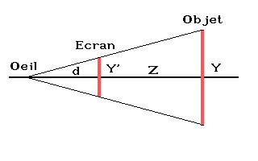
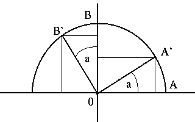
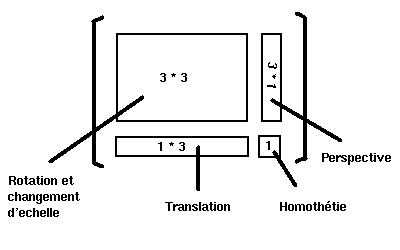
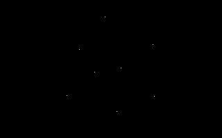
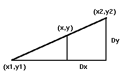
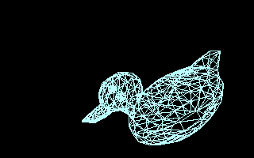
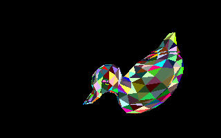
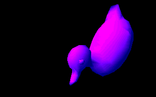

# Introduction

## Présentation]

La 3D est depuis longtemps très largement utilisée en informatique, et les exemples d’applications ne manquent pas.
Mais pour nombre de programmeurs, faire de la 3D relève encore du mystère.
On trouve de plus en plus de jeunes programmeurs, qui ne disposent pas des bases mathématiques nécessaires à leur apprentissage.
Il est certes assez facile de trouver de la documentation dans les nombreux ouvrages traitant de ce sujet, et les sites internet qui y sont consacrés sont en croissance exponentielle.
Seulement, l’anglais étant le langage du web, il est assez difficile de trouver une bonne documentation en français traitant de ce sujet.
Il est également utopique d’espérer trouver le moindre tutoriel, même en anglais, vous expliquant de long en large comment réaliser une animation en 3D a partir de vos simples connaissances en matière de programmation.

C’est pourquoi j’ai décidé de m’atteler à la tache, et des réaliser pour mes amis francophones un ensemble de tutoriaux, qui vous permettront de découvrir les principes des transformations 3D et leur application, ainsi que différents modèles d’éclairage tels qu’ils sont employés dans le domaine des démos.

## Avertissement

Les algorithmes qui sont présentés ici sont des versions simplifiées et non optimisées, le but étant principalement pédagogique.
Il est évident qu’il existe des méthodes bien meilleures, tant en matière de performances que de précision.
Vous serez donc libre d’optimiser selon votre goût les exemples que je vous propose.

Vous êtes totalement libre d’utiliser les sources fournies ici dans vos propres programmes, à but NON COMMERCIAL, et de les modifier a votre gré.
Si vous distribuez des réalisations et que mon aide vous a été utile, merci de me remercier dans la documentation accompagnant votre programme (ça ne coûte rien, et ça me fera plaisir) : je saurais comme ça que mon travail n’a pas été totalement inutile.

## À propos des compilateurs

Les programmes présentés sont pour la plupart écrit en C et compilés avec le Watcom 10.0.
Cependant, vous pouvez adapter ce code à tout type de compilateur et à toute machine, puisqu’il a été réalisé dans un soucis de portabilité.

# Représentation d’un objet en 3D

## Le monde en 3 dimensions

Modéliser un objet de la réalité revient a considérer ses coordonnées spatiales.
Aussi, dessiner un objet en 3D peut ne pas paraître simple au premier abord.
Selon le problème, les structures utilisées peuvent différer.
Nous allons donc nous limiter à une seule représentation, la plus intuitive et très certainement la plus simple à mettre en oeuvre, qui est une représentation hiérarchique.

Nous allons travailler dans le repère cartésien $`(O,X,Y,Z)`$ qui sera notre espace image.
Un objet 3D est caractérisé par sa forme et sa position.
La forme d’un objet est définie par un ensemble de facettes planes, et une face est logiquement définie par les coordonnées de ses sommets.
En général, les coordonnées sont exprimées par rapport au centre de l’objet.
Ce centre est utilisé comme centre de rotation de l’objet.

Ainsi, la position d’un objet dans notre espace image est définie d’une part par les coordonnées de son centre, et d’autre part par son orientation dans l’espace.
Ceci nous mène donc naturellement à utiliser un vecteur de translation $`(Xoff,Yoff,Zoff)`$ et trois angles de rotation distincts (un pour chaque axe).

Pour déterminer la position d’un objet, nous devons connaître les coordonnées de chacun des sommets qui composent ses faces.
En pratique, un même sommet est commun à plusieurs faces.
C’est pourquoi, afin de ne pas recalculer plusieurs fois les mêmes coordonnées, nous ne travaillons qu’avec des points.
Au lieu d’avoir une liste de coordonnées $`(x,y,z)`$ pour représenter nos faces, nous n’aurons qu’une simple liste de numéros référençant les points de l’objet.

## Un exemple simple

Avant d’aller plus loin, prenons un des objets le plus élémentaire en 3D : le Cube.
Pour un cube de coté 200 centré sur l’origine, nous pouvons définir ses sommets de la manière suivante :

|Point #|X|Y|Z|
|---|---|---|---|
|0|-100|-100|-100|
|1|100|-100|-100
|2|100|100|-100|
|3|-100|100|-100|
|4|100|-100|100|
|5|-100|-100|100|
|6|-100|100|100|
|7|100|100|100|

Pour les faces, nous pouvons utiliser la structure suivante :\

|Nb de sommets|Liste des points|
|---|---|
|4|0,1,2,3|
|4|1,4,7,2|
|4|4,5,6,7|
|4|5,0,3,6|
|4|5,4,1,0|
|4|3,2,7,6|

L’objet est définit comme ci-dessous :


Vous pouvez dès à présent remarquer que les numéros des sommets sont donnés de manière à décrire chaque face dans un sens précis.
Dans notre exemple, lorsqu’on regarde une face, ses sommets sont numérotés dans le sens trigonométrique.

## Un premier programme

Bien.
Tout cela est bien joli, mais en pratique qu’est-ce que ça donne ?
Voici un petit programme qui ouvre un écran graphique et qui affiche un cube en perspective ([cube1.zip](src/cube1.zip)).
Pour ce faire, nous utilisons une projection, qui est le seul moyen de représenter un objet 3D en 2D.
Le principe sera expliqué dans le chapitre suivant.

Avant toute chose, il faut définir les sommets du cube.
On peut réaliser cette opération de plusieurs manières, soit statiquement, soit dynamiquement.
La structure utilisée est des plus simples :

```C
typedef struct Point Point;
struct Point
{
  double x;
  double y;
  double z;
};
```

Pour les sommets, nous pouvons les définir de la manière suivante :

```C
Point cube1[8] = {0};
```

puis faire appel à une fonction qui affectera une valeur a chacun de points :

```C
void
Initialiser(void)
{
  cube1[0].x = -100;  cube1[0].y = -100;  cube1[0].z = -100;
  cube1[1].x =  100;  cube1[1].y = -100;  cube1[1].z = -100;
  cube1[2].x =  100;  cube1[2].y =  100;  cube1[2].z = -100;
  cube1[3].x = -100;  cube1[3].y =  100;  cube1[3].z = -100;
  cube1[4].x =  100;  cube1[4].y = -100;  cube1[4].z =  100;
  cube1[5].x = -100;  cube1[5].y = -100;  cube1[5].z =  100;
  cube1[6].x = -100;  cube1[6].y =  100;  cube1[6].z =  100;
  cube1[7].x =  100;  cube1[7].y =  100;  cube1[7].z =  100;
}
```

Nous pouvons également initialiser les valeurs de chacune des coordonnées lors de la déclaration du vecteur des sommets :

```C
Point cube2[8]= { -100,-100,-100,
                   100,-100,-100,
                   100, 100,-100,
                  -100, 100,-100,
                   100,-100, 100,
                  -100,-100, 100,
                  -100, 100, 100,
                   100, 100, 100 };
```

Pour afficher tous les sommets de notre cube, nous devons transformer leurs coordonnées 3D en coordonnées 2D, ce qui revient à faire une projection.
Le principe en est simple : il suffit de diviser les valeurs $`X`$ et $`Y`$ de chaque point par la troisième valeur $`Z`$.
Nous avons alors une *projection perspective*.
Voici un petit schéma simple qui va vous éclairer l’esprit sur ce principe fondamental en 3D :



```math
\frac{d}{Z} = \frac{Y’}{Y} \leftarrow Y’ = \frac{d \times Y}{Z}
```

Vous constatez qu’il est simple de calculer la valeur de $`Y’`$.
Il en est de même pour $`X’`$.
Si vous ne comprenez pas ce principe, reprenez vos cours de math de 4ème, c’est au programme !

En pratique, il est avantageux de choisir pour valeur de $`d`$ une puissance de 2 : cela permet de remplacer une multiplication par un simple décalage arithmétique, beaucoup moins coûteux en temps machine (même si cette tendance disparaît peu à peu).
Voici une procédure C qui affiche chacun des points du cube en blanc :

```C
void
Sommet1(void)
{
  _setcolor(15);

  for (size_t i = 0; i < 8; ++i)
  {
    _setpixel((cube1[i].x*256)/(cube1[i].z+Zoff)+Xoff,
              (cube1[i].y*256)/(cube1[i].z+Zoff)+Yoff);
  }
}
```

Si vous utilisez un autre compilateur que le Watcom C, vous devrez bien sur remplacer les instructions `_setcolor()` et `_setpixel()` par les fonctions similaires disponibles, ou bien encore par votre propres fonctions, comme nous le verrons plus tard.

Une manière bien plus visuelle d’afficher notre cube serait de le dessiner en fil de fer.
Rien de plus simple : il suffit de tracer les arêtes entre les sommets projetés sur le plan de l’écran.
En reprenant le schéma de notre cube, cela devient un jeu d’enfant :

```C
void
FilDeFer(void)
{
  _setcolor(15);

  // On affiche la face avant
  ligne(0,1);
  ligne(1,2);
  ligne(2,3);
  ligne(3,0);

  // Puis la face arrière
  ligne(4,5);
  ligne(5,6);
  ligne(6,7);
  ligne(7,4);

  // Et enfin les arêtes restantes
  ligne(0,5);
  ligne(1,4);
  ligne(2,7);
  ligne(3,6);
}
```

Voilà pour notre premier programme consistant à afficher un objet 3D.

Vous pouvez retrouver les sources et l’exécutable MS-DOS dans [cube1.zip](src/cube1.c)

# Les transformations géométriques

La programmation en 3D est rarement limitée à des objets immobiles, en particulier dans le domaine des démos.
Tout mouvement peut se décomposer en une translation et une rotation, et dans le cas échéant on peut inclure le changement d’échelle.
Les objets subissent donc un certain nombre de transformations géométriques, afin de donner une illusion de mouvement.
Ces transformations ne sont pas très compliquées d’un point de vue mathématiques, et elles sont de plus en plus câblées sur de nombreux processeurs (par exemple sur les Silicon Graphics) mais il est tout de même bon de les présenter clairement, car vous serez très certainement amené à les programmer.

## La translation

On appelle translation un déplacement simple dans une direction fixe.
Elle est matérialisée par une addition vectorielle, tout simplement.
Par exemple, pour déplacer un point $`P(x,y)`$ de $`dx`$ unités selon l’axe des x et de $`dy`$ unités par rapport à l’axe des y il suffit de faire :

```math
x’ = x + dx

y’ = y + dy
```

Le point $`P’(x’,y’)`$ sera donc le point obtenu par la translation de vecteur $`T(dx,dy)`$.
En 3D, il suffit d’ajouter une dimension : le fonctionnement est strictement identique.
En résumé, la translation peut s’écrire sous la forme :

```math
P’ = P + T
```

Pour déplacer un objet par une translation, il suffit d’appliquer la même transformation à tous ses points.

## Le changement d’échelle

On peut effectuer aussi facilement un changement d’échelle sur un objet, ce qui permet de le « grossir » ou au contraire de le « rétrécir ».
Dans ce cas, il faut faire une multiplication de la forme :

```math
x’ = sx \times x
```

```math
y’ = sy \times y
```

Le point $`P’(x’,y’)`$ sera le point obtenu par la multiplication du point $`P`$ et de la matrice $`S(sx,sy)`$.
On écrira donc $`P’= S \cdot P`$, où $`S`$ est une matrice du type :

```math
S = \begin{bmatrix} Sx & 0 \\ 0 & Sy \end{bmatrix}
```

## La rotation

Contrairement aux idées reçues, les calculs de rotations ne sont pas très compliqués, pour peu que l’on ait des vagues souvenirs de trigonométrie et que l’on sache manipuler les matrices.

Plaçons-nous dans le plan avec l’exemple suivant :



Nous avons ici une rotation d’angle a autour de l’origine.
En supposant que les points $`A`$ et $`B`$ soient sur le cercle trigonométrique (pour ceux qui aurait oublié : $`A(1,0)`$ et $`B(0,1)`$), nous avons clairement :

```math
x_{A’} = cos(a) \quad \text{et} \quad x_{B’} = -sin(a)
```

```math
y_{A’} = sin(a) \quad \text{et} \quad y_{B’} = cos(a)
```

Cette opération n’est autre qu’un calcul matriciel, et vous devez certainement savoir comment l’effectuer.
La rotation matrice de la rotation $`R`$ d’angle $`a`$ est donc :


```math
R = \begin{bmatrix} cos(a) & -sin(a) \\ sin(a) & cos(a) \end{bmatrix}
```

On peut maintenant généraliser le problème à tous les points du plan en utilisant cette matrice $`R`$.
La rotation d’un point $`P`$ autour de l’origine devient alors :

```math
x’ = x \times cos(a) - y \times sin(a)
```

```math
y’ = x \times sin(a) + y \times cos(a)
```

Pour passer en 3D, rien de plus facile : il suffit d’ajouter une dimension à notre matrice.
Dans une rotation, il est important de distinguer les axes concernés ; aussi nous allons voir la matrice associée à la rotation autour de chaque axe.
Commençons par la rotation autour de l’axe des X : il est clair que nous pouvons déduire la matrice à partir de celle que nous venons de voir.
Il suffit pour cela d’observer que la rotation autour de l’axe des X ne modifiera pas les composantes X des coordonnées du point considéré (où de l’objet).

Voici l’allure qu’auront nos matrices pour une rotation respectivement autour des des axes X, Y et Z :

```math
R_{x} = \begin{bmatrix} 1 & 0 & 0 \\ 0 & cos(a) & -sin(a) \\ 0 & sin(a) & cos(a) \end{bmatrix}

\begin{align}
x’ = x\\
y’ = y \times cos(a) - z \times sin(a)\\
z’ = y \times sin(a) + z \times cos(a)
\end{align}
```

```math
R_{y} = \begin{bmatrix} cos(a) & 0 & -sin(a) \\ 0 & 1 & 0 \\ sin(a) & 0 & cos(a) \end{bmatrix}

\begin{align}
x’ = x \times cos(a) + z \times sin(a)\\
y’ = y\\
z’ = -x \times sin(a) + z \times cos(a)
\end{align}
```

```math
R_{z} = \begin{bmatrix} cos(a) & -sin(a) & 0 \\ sin(a) & cos(a) & 0 \\ 0 & 0 & 1 \end{bmatrix}

\begin{align}
x’ = x \times cos(a) + y \times sin(a)\\
y’ = -x \times sin(a) - y \times cos(a)\\
z’ = z
\end{align}
```

Voilà pour nos rotations.
Mais, me direz-vous, pourquoi se promener avec 3 matrices, et non pas une seule ?
En fait, le problème est un petit peu plus compliqué que ça, et l’on en reparlera un peu plus tard lorsque nous verrons les matrices homogènes.
On peut en effet n’avoir qu’une seule matrice : il suffit de les combiner entre elles.
Il s’agit encore une fois d’un simple produit matriciel, mais je ne vous donnerez pas la formule, elle est trop longue pour tenir sur une seule ligne :o) Si vous etes courageux je vous laisse le soin de la trouver.

A ce niveau, vous pouvez déjà réaliser toutes les animations que vous voulez, puisque nous avons abordé toutes les bases mathématiques nécessaires.
Mais il nous reste encore un problème à résoudre : comment afficher une objet représenté en 3D sur un petit écran tout plat qui ne compte lui que 2 dimensions ? Rassurez-vous, la solution est relativement simple, et si vous avez suivit jusque-là cela ne vous causera en principe pas de problème particulier.

## La projection

Pour passer d’une dimension 3 à une dimension 2, il faut projeter les coordonnées des sommets qui composent la scène à visualiser.
Il existe plusieurs types de projection : la *projection parallèle* et la *projection perspective*.
La première est utilisée en architecture, alors que le seconde est utilisée pour le rendu réaliste, car elle rend compte des distances et donne véritablement une impression de profondeur à la scène.
C’est celle que nous avons vue dans le chapitre précédent, et que nous allons utiliser par la suite.

Dans ce cas de figure, le principe consiste à projeter les points sur un plan situé devant le point d’observation.
Reprenons notre petit schéma :


```math
\frac{d}{Z} = \frac{Y’}{Y} \leftarrow Y’ = \frac{d \times Y}{Z}
```

Vous constatez qu’il est simple de calculer la valeur de $`Y’`$.
Il en est de même pour $`X’`$.
Il s’agit ici d’une formule simplifiée pour nos besoins, et qui va s’avérer très rapide est efficace, mais qui risque de nous limiter.
Donc si jamais vous avez besoin un jour d’un vrai formules de projection perspective, vous avez de la chance les voici :

```math
X’ = Xo + Zo \times \frac{X-Xo}{Zo-Z}
```

```math
Y’ = Yo + Zo \times \frac{Y-Yo}{Zo-Z}
```

Ces formules tiennent compte de la position de l’observateur, qui est situé au point $`O(Xo,Yo,Zo)`$.
En supposant que l’on ait $`Xo=Yo=0`$, on a l’oeil qui est situé quelque par sur l’axe des Z, et l’on retombe sur les formules précédentes.
C’est une petite optimisation qui simplifie la vie des débutants, mais qui n’est pas valable dans le cas général.

Comme vous l’avez certainement constaté, le dessin en 2D n’est pas réellement mon domaine de prédilection.
Je ne vais donc pas vous faire de petit dessin pour illustrer mes formules, d’autant qu’elles sont compréhensibles.

## Les coordonnées homogènes

Les coordonnées homogènes sont utilisées en synthèse d’image afin d’unifier le traitement des transformations géométriques d’une scène et de les regrouper dans une seule matrice.
En effet, si l’on utilise une matrice $`2 \times 2`$ pour les scènes bidimensionnelles et une matrice $`3 \times 3`$ pour les scènes tridimensionnelles, ces matrices ne peuvent exprimer que des rotations.

Pour exprimer aussi les translations, les changements d’échelle et les projections, on va utiliser des matrices $`4 \times 4`$ pour les scènes tridimensionnelles.

Ainsi, si $`(x,y,z)`$ sont les coordonnées d’un point de la scène à transformer et $`M_{H}`$ la matrice $`4 \times 4`$ de coordonnées homogènes, on effectuera la multiplication :

```math
M_{H} \times [ x y z 1 ]
```

ce qui donnera comme résultat $`[ X Y Z H ]`$.

Les coordonnées du point transformé seront alors $`(\frac{X}{H}, \frac{Y}{H}, \frac{Z}{H})`$.

La matrice $`4 \times 4`$ des coordonnées homogènes peut être considérée comme étant composée de 4 sous-matrices, chacune d’elle étant associée à un type de transformation.



# Mise en pratique

Maintenant que nous disposons d’un bon nombre d’éléments mathématiques nécessaires à la synthèse d’image 3D, il est temps de passer à une application concrète.
Pour cela, nous allons reprendre le cube de notre premier exemple, et lui appliquer les transformations géométriques que nous venons de découvrir au chapitre précédent.

## Les outils graphiques nécessaires

Toutes les séquences de code présentées sont entièrement portables, si ce n’est les primitives graphiques (initialisation du mode graphique, affichage d’un pixel…).
Aussi, afin de pousser encore un peu plus la portabilité de mes programmes, je vais utiliser un écran virtuel dans lequel on dessinera la scène à afficher.
Ainsi, la seule fonction non portable est celle qui effectue le transfert de cette zone mémoire vers la zone d’écran.
Il est donc relativement simple d’adapter les programmes à n’importe quel type de machine.

A titre d’illustration, l’ensemble de ces primitives a été regroupé dans un fichier séparé, [graphics.c.](src/graphics.c) A ce niveau, il n’est pas nécessaire de se soucier de la manière dont cela est géré, même si c’est relativement simple.
Par la suite, dans un soucis d’optimisation, il faudra pouvoir accéder directement à l’écran virtuel sans passer par des primitives.

## Animation des sommets d’un cube

Comme la plus grande majorité des débutants en 3D, nous allons commencer par animer les sommets d’un cube.
Partant de cela, il est possible d’animer n’importe quel type d’objet.
Il y aura cependant de nouveaux éléments à acquérir pour pouvoir afficher correctement des objets aux faces pleines, chose que nous verrons dans un chapitre suivant.
Les sources complètes sont disponibles dans [cube2.zip](src/cube2.zip).

Une des étapes essentielles à l’animation est la rotation des sommets.
Maintenant que nous savons comment cela fonctionne, nous allons écrire une fonction.

```C
void
Rotation(int Xa, int Ya, int Za)
{
  // Calcul de la matrice de rotation 3*3

  matrice[0][0] = Cos[Za] * Cos[Ya];
  matrice[1][0] = Sin[Za] * Cos[Ya];
  matrice[2][0] = -Sin[Ya];

  matrice[0][1] = Cos[Za] * Sin[Ya] * Sin[Xa] - Sin[Za] * Cos[Xa];
  matrice[1][1] = Sin[Za] * Sin[Ya] * Sin[Xa] + Cos[Xa] * Cos[Za];
  matrice[2][1] = Sin[Xa] * Cos[Ya];

  matrice[0][2] = Cos[Za] * Sin[Ya] * Cos[Xa] + Sin[Za] * Sin[Xa];
  matrice[1][2] = Sin[Za] * Sin[Ya] * Cos[Xa] - Cos[Za] * Sin[Xa];
  matrice[2][2] = Cos[Xa] * Cos[Ya];

  // Rotation des sommets de l'objet
  for (size_t i = 0; i < Nb_points; i++)
  {
    Point3D[i].x = matrice[0][0] * Sommet[i].x +
                   matrice[1][0] * Sommet[i].y +
                   matrice[2][0] * Sommet[i].z;

    Point3D[i].y = matrice[0][1] * Sommet[i].x +
                   matrice[1][1] * Sommet[i].y +
                   matrice[2][1] * Sommet[i].z;

    Point3D[i].z = matrice[0][2] * Sommet[i].x +
                   matrice[1][2] * Sommet[i].y +
                   matrice[2][2] * Sommet[i].z;
  }
}

```

Comme vous pouvez le constater, nous calculons au préalable la matrice de rotation, et ensuite nous transformons chaque sommet.
Si l’on ne tient pas compte de l’étape de calcul de la matrice, cela nous fera ensuite 9 multiplications par sommets.
Si on n’utilisait pas de matrice, nous aurions 12 multiplications par sommet.
Sachant qu’un objet 3D peut contenir plusieurs milliers, voire dizaines de milliers de sommets, le gain n’est pas si négligeable que cela.

Il est possible d’améliorer encore cette rotation.
Une méthode bien connue de tous aujourd’hui permet de descendre à 6 multiplications par sommets.
Pour arriver à ce résultat il suffit de factoriser de façon judicieuse.
Je ne vais pas vous faire de démonstration, je vous donne simplement la fonction correspondante.
A titre d’indication, je n’ai pas noté de gain notable sur ma machine, mais les fous d’optimisation y trouveront leur compte.
Sachez aussi que l’on peut encore réduire le nombre de multiplications.

```C
void
Rotation6Mul(int Xa, int Ya, int Za)
{
  matrice[0][0] = Cos[Za] * Cos[Ya];
  matrice[1][0] = Sin[Za] * Cos[Ya];
  matrice[2][0] = -Sin[Ya];

  matrice[0][1] = Cos[Za] * Sin[Ya] * Sin[Xa] - Sin[Za] * Cos[Xa];
  matrice[1][1] = Sin[Za] * Sin[Ya] * Sin[Xa] + Cos[Xa] * Cos[Za];
  matrice[2][1] = Sin[Xa] * Cos[Ya];

  matrice[0][2] = Cos[Za] * Sin[Ya] * Cos[Xa] + Sin[Za] * Sin[Xa];
  matrice[1][2] = Sin[Za] * Sin[Ya] * Cos[Xa] - Cos[Za] * Sin[Xa];
  matrice[2][2] = Cos[Xa] * Cos[Ya];

  float a[3] = {
    [0] = -(matrice[0][1] * matrice[0][0]),
    [1] = -(matrice[1][1] * matrice[1][0]),
    [2] = -(matrice[2][1] * matrice[2][0]),
  };

  for (size_t i = 0; i < Nb_points; i++)
  {
    Point3D[i].x = (matrice[0][1] + Sommet[i].x)
                 * (matrice[0][0] + Sommet[i].y)
                 + a[0] + Sommet[i].xy
                 + matrice[0][2] * Sommet[i].z;

    Point3D[i].y = (matrice[1][1] + Sommet[i].x)
                 * (matrice[1][0] + Sommet[i].y)
                 + a[1] + Sommet[i].xy
                 + matrice[1][2] * Sommet[i].z;

    Point3D[i].z = (matrice[2][1] + Sommet[i].x)
                 * (matrice[2][0] + Sommet[i].y)
                 + a[2] + Sommet[i].xy
                 + matrice[2][2] * Sommet[i].z;
  }
}

```

Il faut ajouter un nouveau champ à chaque sommet, appelé ici `Sommet[i].xy`.
Cette valeur doit être initialisée au début du programme et n’a pas besoin d’être recalculée par la suite.

```C
Sommet[i].xy = -Sommet[i].x * Sommet[i].y;
```

Après avoir fait la rotation de chacun des sommets de notre joli petit cube, il nous faut encore les projeter sur notre écran.
Pour simplifier le code (et l’optimiser un tout petit peu), nous allons placer l’observateur dans l’axe exact de l’objet (face au centre de l’écran).

```C
void
Projection(void)
{
  for (size_t i = 0; i < Nb_points; i++)
  {
    Point2D[i].x = (Point3D[i].x << 8) / (Point3D[i].z + Zoff) + Xoff;
    Point2D[i].y = (Point3D[i].y << 8) / (Point3D[i].z + Zoff) + Yoff;
  }
}   
```

Comme vous le voyez, rien de bien compliqué, surtout si vous avez compris les justifications mathématiques.

Il ne nous reste plus qu’à afficher le tout à l’écran, sinon ça risque de ne pas donner grand chose :o)

```C
void
Afficher(int couleur)
{
  // On efface le contenu de l'écran virtuel
  ClearBuffer();

  // On dessine dedans
  for (size_t i = 0; i < 8; i++)
  {
    PutPixel(Point2D[i].x, Point2D[i].y, couleur);
  }

  // On affiche le tout a l'écran, en synchonisant
  WaitVbl();
  ShowBuffer();
}
```

En fait, on ne fait qu’afficher tous les sommets du cube.
Étant donné qu’on utilise un écran virtuel, il faut effacer son contenu avant de commencer à dessiner dedans.
Ensuite, on dessine chaque sommet dans le buffer, et on affiche le tout.
On attend cependant le retour du faisceau vertical qui balaie l’écran, afin d’éviter tout effet de « flic ».

Enfin il ne reste plus qu’à gérer cette animation.
Nous allons tout simplement faire tourner notre cube autour du centre de l’écran.
Ce n’est certes pas très extraordinaire, mais c’est très simple à faire :

```C
// Animation de note cube jusqu'à pression d'une touche
while (!kbhit())
{
  Rotation(xa, ya, za);
  Projection();
  Afficher(100);
  xa = (xa + 1) % 360;
  ya = (ya + 3) % 360;
  za = (za + 1) % 360;
}
```



*Les sommets du cube en pleine animation*

Et voilà !Nous venons de faire notre première animation 3D.
Vous retrouverez les sources et l’exécutable dans [cube2.zip](src/cube2.zip).
Pour compiler chez vous, vous pouvez faire un Makefile, ou encore taper simplement :

```Bash
wcl386 cube2.c graphics.c
```

## Un algorithme de tracé de ligne

Bien que cela ne soit pas propre à la synthèse d’image tridimensionnelles, il est tout de même important de savoir comment tracer une droite sur un écran, surtout lorsqu’on veut afficher un objet en fil de fer.
Pour cela, il existe de nombreux algorithmes bien éprouvés.
Le plus célèbre est celui de Bresenham, et c’est aussi le meilleur.
Vous trouverez cet algorithme sur de nombreux sites et dans beaucoup d’ouvrages dédiés à la synthèse d’image.
Il s’agit d’une méthode incrémentale.

Le but d’un tel algorithme est d’approcher le segment réel par un ensemble de points allumés.
Tout reste à savoir quels pixels allumer.

Si $`(x1,y1)`$ sont les coordonnées du début du segment à afficher et $`(x2,y2)`$ ses coordonnées de fin, on va poser :

```math
Dx = | x2 - x1 | \quad \text{et} \quad Dy = | y2 - y1 |
```

Pour le moment, supposons que $`Dy < Dx`$ et que $`x1 < x2`$.

La pente du segment à afficher est donnée par $`\frac{Dy}{Dx}`$.
La méthode utilisée consiste à allumer des points dans une seule direction, ici la direction $`x`$, et n’allumer de points dans la direction $`y`$ que si l’erreur entre la pente obtenue et la pente idéale dépasse un certain seuil.
Ainsi, si $`(x,y)`$ sont les coordonnées du point courant (en cours d’affichage), on aura en arithmétique réelle :

```
pente = Dy / Dx
y = y1
pour x variant de x1 à x2
{
  afficher(x, arrondi(y))
  y = y + a
}
```



On voit que l’on a $`y = y1 + (x-x1) \times \frac{Dy}{Dx}`$.
Comme on allume les points dans la direction x, on aura $`x_{i+1} = x_{i} + 1`$ ce qui donnera $`y_{i+1} = y_{i} + \frac{Dy}{Dx}`$
ce qui fait que l’erreur commise si l’on allume un point dans la direction x est de $`\frac{Dy}{Dx}`$

L’erreur est cumulée dans une variable.
À chaque fois on l’incrémente de $`\frac{Dy}{Dx}`$ et l’on commence à allumer des points dans l’autre direction dès que l’erreur dépasse la valeur 1.
Pour éviter d’avoir des réels, on utilisera $`Dy`$ comme pente au lieu de $`\frac{Dy}{Dx}`$ (on a multiplié par $`Dx`$) et au lieu de tester avec la valeur 1, le test se fera avec $`Dx (1 \times Dx)`$.

Voilà la fonction C qui tient compte de tous les cas de figures possibles :

```C
void
Line(int x1, int y1, int x2, int y2, int couleur)
{
  int x;
  int y;
  int Dx;
  int Dy;
  int xincr;
  int yincr;
  int erreur;

  // On initialise nos variables
  Dx = abs(x2 - x1);
  Dy = abs(y2 - y1);

  if (x1 < x2)
  {
    xincr = 1;
  }
  else
  {
    xincr = -1;
  }

  if (y1 < y2)
  {
    yincr = 1;
  }
  else
  {
    yincr = -1;
  }

  // Trace de ligne
  x = x1;
  y = y1;
  if (Dx > Dy)
  {
    erreur = Dx / 2; // c'est plus esthétique comme ça
    for (size_t i = 0; i < Dx; i++)
    {
      x += xincr;
      erreur += Dy;
      if (erreur > Dx)
      {
        erreur -= Dx;
        y += yincr;
      }
      PutPixel(x, y, couleur);
    }
  }
  else
  {
    erreur = Dy / 2; // c'est plus esthétique comme ça
    for (size_t i = 0; i < Dy; i++)
    {
      y += yincr;
      erreur += Dx;
      if (erreur > Dy)
      {
        erreur -= Dy;
        x += xincr;
      }
      PutPixel(x, y, couleur);
    }
  }
}
```

## Représentation filière (fil de fer)

A présent nous pouvons afficher notre cube en fil de fer, sans tenir compte pour le moment des faces cachées ([cube3.zip](src/cube3.zip)).
Pour cela, il suffit d’afficher chaque arête de chacune des faces.
On s’aperçoit donc que certaines arêtes sont affichées plusieurs fois, ce qui est inutile.
Pour remédier à ce problème, il faut en principe ajouter des informations supplémentaires à nos facettes, pour dire quelles sont les arêtes à afficher.
Faire ce travail à la main est en général très laborieux, aussi il est bon d’utiliser des objets provenants d’un modeleur.
Pour l’instant, notre cube est assez simple pour faire ce travail manuellement.

```C
void
FilDeFer(int couleur)
{
  // On affiche la face avant
  ligne(0, 1, couleur);
  ligne(1, 2, couleur);
  ligne(2, 3, couleur);
  ligne(3, 0, couleur);

  // Puis la face arriere
  ligne(4, 5, couleur);
  ligne(5, 6, couleur);
  ligne(6, 7, couleur);
  ligne(7, 4, couleur);

  // Et enfin les arêtes restantes
  ligne(0, 5, couleur);
  ligne(1, 4, couleur);
  ligne(2, 7, couleur);
  ligne(3, 6, couleur);
}
```

La fonction `ligne()` est là pour simplifier le code et le rendre plus lisible :

```C
void
ligne(int a, int b, int couleur)
{
  Line(Point2D[a].x, Point2D[a].y, Point2D[b].x, Point2D[b].y, couleur);
}
```


*Le cube en fil de fer*

Les sources complètes et l’exécutables sont disponibles dans [cube3.zip](src/cube3.zip).

## Charger des objets de 3D Studio

Les cubes, c’est vrai que c’est idéal pour débuter, mais ça devient vite lassant.
Je vais donc vous proposer une fonction ([objet.zip](src/objet.zip)) qui va vous permettre de manipuler dans vos programmes des objets provenant d’un logiciel bien connu, le modeleur de 3D Studio.
Nous allons en particulier nous intéresser au format `.ASC`, qui est le format ascii de 3DS.
Ce format est en effet très simple à gérer, en plus des nombreux avantages qu’il peut apporter.

Je ne vais pas vous décrire en détail le format en question, puisque je fournit les sources nécessaires pour charger les objets.
De plus, les fichiers sauvés à ce format sont parfaitement lisibles, et vous n’aurez en principe aucun mal à comprendre le format et à le gérer vous-même.

Rapidement, les objets sont formés uniquement de facettes triangulaires, et un fichier peut contenir plusieurs objets.
Après la liste des points et de leur coordonnées X, Y et Z (éventuellement U et V pour les textures) on trouve la liste des facettes.
Voici un exemple de « loader » de fichier `.ASC` :

```C
/************************************************************************/
/* ChargerASC() : charge en memoire un objet au format .asc             */
/*                (format ascii de 3DS)                                 */
/*                La memoire n'est pas allouee dynamiquement dans un    */
/*                soucis de lisibilite (programme a but pedagogique     */
/************************************************************************/

void
ChargerASC(char* nom)
{
  FILE* fichier;
  char chaine[200];
  char* fin;
  int i;
  int j;
  char temp[50];
  float x;
  float y;
  float z;
  int a;
  int b;
  int c;

  int decalage = 0;

  if ((fichier = fopen(nom, "rt")) == NULL)
  {
    perror("Impossible d'ouvrir le fichier en lecture");
    exit(-2);
  }

  do
  {
    // On lit le fichier contenant les informations sur l'objet
    fin = fgets(chaine, 100, fichier);
    if (!strncmp(chaine, "Vertex", 6))
    {
      if (strncmp(chaine, "Vertex list", 11))
      {
        // Lecture des coordonnées d'un point
        i = 0;

        while (chaine[i] != 'X')
        {
          i++;
        }
        i += 2;
        while (chaine[i] == ' ')
        {
          i++;
        }
        sscanf(chaine + i, "%f", &x);

        while (chaine[i] != 'Y')
        {
          i++;
        }
        i += 2;
        while (chaine[i] == ' ')
        {
          i++;
        }
        sscanf(chaine + i, "%f", &y);

        while (chaine[i] != 'Z')
        {
          i++;
        }
        i += 2;
        while (chaine[i] == ' ')
        {
          i++;
        }
        sscanf(chaine + i, "%f", &z);

        Sommet[Nb_points].x = x;
        Sommet[Nb_points].y = y;
        Sommet[Nb_points].z = z;

        Nb_points++;
      }
    }
    else
    {
      if (!strncmp(chaine, "Face", 4))
      {
        if (strncmp(chaine, "Face list", 9))
        {
          // Lecture d'une facette
          i = j = 0;
          while (chaine[i] != 'A')
          {
            i++;
          }
          i += 2;
          j = i;
          while (chaine[j] != ' ')
          {
            j++;
          }
          strncpy(temp, chaine + i, j - i);
          temp[j - i] = 0;
          Facette[Nb_faces].a = atoi(temp) + decalage;

          while (chaine[i] != 'B')
          {
            i++;
          }
          i += 2;
          j = i;
          while (chaine[j] != ' ')
          {
            j++;
          }
          strncpy(temp, chaine + i, j - i);

          temp[j - i] = 0;
          Facette[Nb_faces].b = atoi(temp) + decalage;

          while (chaine[i] != 'C')
          {
            i++;
          }
          i += 2;
          j = i;
          while (chaine[j] != ' ')
          {
            j++;
          }
          strncpy(temp, chaine + i, j - i);
          temp[j - i] = 0;
          Facette[Nb_faces].c = atoi(temp) + decalage;

          // Lecture des aretes visibles
          while (chaine[i] != 'A')
          {
            i++;
          }

          strncpy(temp, chaine + i + 3, 1);
          temp[j - i] = 0;
          Facette[Nb_faces].ab = atoi(temp);

          strncpy(temp, chaine + i + 8, 1);
          temp[j - i] = 0;
          Facette[Nb_faces].bc = atoi(temp);

          strncpy(temp, chaine + i + 13, 1);
          temp[j - i] = 0;
          Facette[Nb_faces].ac = atoi(temp);

          Nb_faces++;
        }
      }
      else
      {
        if (!strncmp(chaine, "Named object", 12))
        {
          decalage = Nb_points;
        }
      }
    }
  } while (fin != NULL);

  fclose(fichier);
}
```

Bien entendu, vous pouvez retrouver un exemple de programme utilisant cette fonction dans [objet.zip](src/objet.zip).
Pour lancer l’executable, vous pouvez taper par exemple :

**objet `duck.asc`**



*Un petit canard en pleine rotation*

Le fichier `duck.asc` est un exemple fournit avec l’exécutable : vous pourrez ainsi faire tourner vous-même ce fameux petit canard si bien connu.

Le programme charge en mémoire les coordonnées de chacun des sommets, et affiche ensuite toutes les arêtes de l’objet.
Ici, nous tenons compte du fait qu’une arête est visible ou non, puisque cette information est présente dans le format `.ASC`.

Par la suite, nous utiliserons ce type d’objets pour les programmes d’application.

# Les objets à faces pleines

Nos objets commencent à prendre de l’allure, mais ils sont toujours en fil de fer.
Pour passer à l’étape suivante et éliminer les parties cachées, nous devons commencer par apprendre à remplir des polygones.
Dans notre cas, nous nous limiterons aux polygones convexes, ce qui est largement suffisant en 3D.
D’ailleurs, vu que nous gérons à présent uniquement des objets de 3DS, nous sommes surs que nous n’aurons que des triangles à remplir.
Cependant, les fonctions fournies permettront de remplir n’importe quel type de polygones convexe, mais libre à vous de les optimiser.

## Remplissage de polygones

Si nous nous limitons aux polygones convexes, c’est qu’il y a une bonne raison.
En effet, lorsque nous dessinons un polygone, nous traçons en fait des lignes horizontales.
Avec cette restriction, nous n’aurons besoin de stocker que l’abscisse de départ et de fin pour chaque ligne Y de l’écran.

Notre algorithme va donc devoir commencer par calculer la coordonnée X de début et de fin de la ligne horizontale pour chaque ligne Y.
Pour cela, nous allons modifier notre algorithme de tracé de droite, mais au lieu de dessiner des points, nous allons stocker la coordonnée x dans un tableau approprié.
Ensuite, nous n’aurons plus qu’à dessiner des lignes horizontales entre les coordonnées X qui auront été stockées ([objet3.zip](src/objet3.zip)).

Nous avons donc besoin de 2 tableaux pour stocker les coordonnées de départ et de fin pour chaque ligne horizontale :

```C
int startx[200];
int endx[200];
```

Nous n’avons besoin que de 200 éléments puisque nous travaillons en mode 320 par 200, 256 couleurs.
Si vous changer de mode,vous devrez changer la taille de ces tableaux.

Avant de dessiner un polygone, les valeurs de ces tableaux sont initialisées à des valeurs impossibles dans la réalité (j’utilise -16000, mais c’est totalement arbitraire).

Maintenant il faut modifier l’algorithme de tracé de droite, qui va stocker une valeur X pour chaque coordonnée Y.
Si la valeur contenue dans `startx[y]` vaut -16000, alors nous la stockons dans ce tableau, sinon cela signifie qu’une valeur y est déjà présente, et donc nous la mettons dans `endx[y]`.
Ainsi il ne peut pas y avoir de perte d’information si notre algorithme est bien conçu (je vous rassure, je pense que c’est le cas).

Voyons ce que cela donne concrètement :

```C
void
InitSegment(int x1, int y1, int x2, int y2)
{
  int temp;
  int y;
  long x;
  long pas;

  if (y2 != y1)
  {
    if (y2 < y1)
    {
      temp = y1;
      y1 = y2;
      y2 = temp;

      temp = x1;
      x1 = x2;
      x2 = temp;
    }

    x = x1 << 8;
    pas = ((x2 - x1) << 8) / (y2 - y1);

    x += pas;
    y1++;

    if (y1 < miny)
    {
      miny = y1;
    }
    if (y2 > maxy)
    {
      maxy = y2;
    }

    for (y = y1; y <= y2; y++)
    {
      if ((y >= 0) && (y < Ymax))
      {
        if (startx[y] == -16000)
        {
          startx[y] = x >> 8;
        }
        else
        {
          endx[y] = x >> 8;
        }
      }
      x += pas;
    }
  }
}
```

Pour accélérer les calculs, nous travaillons en arithmétique entière.
En fait, nous utilisons des chiffres à virgule fixe.
L’abscisse **X** est multipliée par **256** et nous lui ajoutons à chaque étape la valeur **pas**, qui est une constante.
On ne calcule qu’une seule coordonnée X par ligne Y.

Ce type de calcul en virgule fixe peut être adapté à l’assembleur de façon très efficace, et fournir un code d’une rapidité assez étonnante.
Faites l’essai, le résultat en vaut le coût.

Du point de vue utilisateur, nous n’avons pas besoin d’appeler cette fonction.
Pour remplir un polygone, nous devons lui passer en paramètre un pointeur sur un tableau de point, le nombre de points du polygone et la couleur à utiliser.
Le reste est entièrement géré par la fonction `FillPoly()`. C’est elle qui fera appel à `InitSegment()` pour chacune des arêtes du polygone, et qui tracera les lignes horizontales.

```C
void
FillPoly(point* vertexlist, int numvertex, int color)
{
  int i;
  point* curpt;
  point* nextpt;

  miny = Ymax;
  maxy = 0;

  /* On fait appel a InitSegment pour chaque arête */

  curpt = vertexlist;
  nextpt = vertexlist + 1;

  for (i = 1; i < numvertex; i++)
  {
    InitSegment(curpt->x, curpt->y, nextpt->x, nextpt->y);
    curpt++;
    nextpt++;
  }

  nextpt = vertexlist;
  InitSegment(curpt->x, curpt->y, nextpt->x, nextpt->y);

  if (miny < 0)
  {
    miny = 0;
  }
  if (maxy >= Ymax)
  {
    maxy = Ymax - 1;
  }

  // On trace les lignes horizontales

  for (i = miny; i <= maxy; i++)
  {
    if (endx[i] == -16000)
    {
      PutPixel(startx[i], i, color);
    }
    else
    {
      Hline(startx[i], endx[i], i, color);
    }

    startx[i] = endx[i] = -16000;
  }
}
```

Au lieu de faire appel au tracé de droite classique, qui fonctionnerait parfaitement, il est préférable d’utiliser une fonction spécifique qui sera optimisée.
Il s’agit de la fonction `Hline()` :

```C
void
Hline(int x1, int x2, int y, int color)
{
  int x;
  int offset;

  if (y < 0 || y >= Ymax)
  {
    return;
  }

  if (x1 > x2)
  {
    x = x1;
    x1 = x2;
    x2 = x;
  }

  offset = y * 320 + x1;

  for (x = x1; x <= x2; x++)
  {
    if (x >= 0 && x < Xmax)
    {
      screen[offset] = color;
    }
    offset++;
  }
}
```

Rien de plus simple en somme.
Remarquez cependant que le test suivant

```C
if (x >= 0 && x < Xmax)
```

permet de réaliser un clipping des plus primaires, mais efficace.

Voici un exemple d’utilisation de la fonction de remplissage de polygone :

```C
void
Remplir(face facette)
{
  point p[3] = {
  [0] = Point2D[facette.a],
  [1] = Point2D[facette.b],
  [2] = Point2D[facette.c],
  };

  FillPoly(p, 3, facette.couleur);
}
```

## Les faces cachées

Avant de remplir chacune des facettes de notre objet 3D, nous devons éliminer celles qui ne sont pas visibles par l’observateur.
Dans le cas d’un objet convexe comme un cube ou une sphère, cela sera satisfaisant ([objet2.zip](src/objet2.zip)).
Pour des objets concaves, tels un tore ou le petit canard, il faudra en plus trier les facettes selon leur distance à l’observateur ([objet3.zip](src/objet3.zip)).

Étant donné les restrictions que nous avons fait sur la position de l’observateur, il nous est facile de calculer la visibilité d’une face.
Il suffit en effet de tester le signe de sa normale Pour obtenir la normale d’une face, il faut faire ce que l’on appelle un produit vectoriel : on associe à deux vecteurs un troisième qui leur est perpendiculaire.

```math
\overrightarrow{a} \cdot \overrightarrow{b} =

\begin{bmatrix}
a1 \\ a2 \\ a3
\end{bmatrix}

\cdot

\begin{bmatrix}
b1 \\ b2 \\ b3
\end{bmatrix}

=

\begin{bmatrix}
a2 \cdot b3 - a3 \cdot b2 \\
a3 \cdot b1 - a1 \cdot b3 \\
a1 \cdot b2 - a2 \cdot b1
\end{bmatrix}
```

Voilà ce que cela donne en C :

```C
int
Visible(face f)
{
  long a1 = Point2D[f.a].x - Point2D[f.b].x;
  long b1 = Point2D[f.a].y - Point2D[f.b].y;
  long a2 = Point2D[f.c].x - Point2D[f.b].x;
  long b2 = Point2D[f.c].y - Point2D[f.b].y;

  if ((a1 * b2 - b1 * a2) < 0)
  {
    return 0;
  }
  return 1;
}
```

Il est possible d’éviter ce calcul en pré calculant la normale à chaque facette, et à lui faire subir les mêmes transformations qu’aux sommets (je pense aux rotations).
Dans ce cas, il suffirait de tester le signe de la composante Z de la normale.
Nous verrons comment faire lorsque l’on voudra illuminer nos objets.

En attendant, vous pouvez animer sans problème des objets convexes ([objet2.zip](src/objet2.c)) Cela marche aussi avec des objets concaves (ex duck.asc) mais il y a des parties que l’on voit et qui devraient être invisibles.
Une seule solution : remplir les polygones, et les afficher par ordre décroissant de leur distance à l’observateur.
On pourra ainsi
éliminer toutes les parties invisibles depuis le point d’observation ([objet3.zip](src/objet3.zip)).

## Trier les facettes

Pour tirer nos facettes, nous devons rajouter une information supplémentaire : la distance de cette facette à l’observateur, qui sera dans notre cas la distance z moyenne de la facette.

```C
typedef struct
{
  int a;
  int b;
  int c;
  unsigned char couleur; // couleur propre de la facette
  double z;              // profonceur moyenne de la face
} face;

point3D Sommet[1000];
point3D Point3D[1000];
point Point2D[1000];

face Facette[1000]; // les facettes de l'objet
int tri[1000];      // tableau trie des facettes

int Nb_points = 0;
int Nb_faces = 0;
int Nb_visibles; // pour connaitre le nombre de faces visibles
```

Nous utiliserons également un tableau `tri[]`, qui contiendra l’indice des facettes classées selon leur distance Z, ainsi qu’une variable `Nb_visible` pour connaître le nombre de facettes qui sont partiellement visibles.
Pour afficher notre objet, la fonction utilisée deviendra alors :

```C
void
Afficher(void)
{
  TrierFacettes();

  ClearBuffer();

  for (size_t i = 0; i < Nb_visibles; i++)
  {
    Remplir(Facette[tri[i]]);
  }

  WaitVbl();
  ShowBuffer();
}
```

Pour trier les facettes, nous avons besoin de connaître la profondeur moyenne de chacune des faces composant la scène à afficher.
Il suffit donc de faire la somme de chacune des 3 composantes Z de chaque sommet.
Il est d’ailleurs inutile de diviser cette somme par 3, cela ne changera rien pour le tri.
Enfin, on tri le tableau des facettes **visibles** (pour ne pas afficher des facettes qui de toutes façon seront totalement recouvertes).
Personnellement, j’utilise un QuickSort pour sa rapidité et sa simplicité, mais vous pouvez utiliser votre procédure de tri si cela vous chante.

```C
void
TrierFacettes(void)
{
  Nb_visibles = 0;

  for (size_t i = 0; i < Nb_faces; i++)
  {
    if (visible(Facette[i]))
    {
      Facette[i].z = Point3D[Facette[i].a].z
                   + Point3D[Facette[i].b].z
                   + Point3D[Facette[i].c].z;

      tri[Nb_visibles] = i;
      Nb_visibles++;
    }
  }

  Quick_Sort(0, Nb_visibles - 1);
}
```

Toutes les sources et l’exécutable sont disponibles dans [objet3.zip](src/objet3.zip).
Pour l’utiliser, vous pouvez taper par exemple :

**objet3 duck.asc**



*Objet en faces pleines*

Les facettes sont affichées avec une couleur aléatoire qui est fixée lors du chargement de l’objet contenu dans le fichier .ASC.
Ce n’est pas très joli, mais maintenant vous maîtrisez parfaitement la 3D, et c’est déjà pas si mal !

```C
/************************************************************************/
/* Quick_Sort() : tri le tableau des facettes visibles                  */
/************************************************************************/

void
Quick_Sort(int deb, int fin)
{
  int i = deb;
  int j = fin;
  double milieu = Facette[tri[(deb + fin) / 2]].z;
  int temp;

  while (i <= j)
  {
    while (Facette[tri[i]].z > milieu)
    {
      i++;
    }
    while (Facette[tri[j]].z < milieu)
    {
      j--;
    }

    if (i <= j)
    {
      temp = tri[i];
      tri[i] = tri[j];
      tri[j] = temp;
      i++;
      j--;
    }
  }

  if (i < fin)
  {
    Quick_Sort(i, fin);
  }
  if (deb < j)
  {
    Quick_Sort(deb, j);
  }
}
```

## Technique du Z-Buffer

Le Z-Buffer a été développé par Catmul en 1974.
C’est l’algorithme le plus simple pour dessiner une scène tridimensionnelle contenant des faces cachées.
Son implémentation est très simple, et consiste à avoir en plus du buffer image (endroit où l’on dessine notre scène) un buffer du profondeur, appelé **Z-Buffer**.
Ce tableau doit être exactement de la même taille que l’espace image, et va contenir pour chaque pixel la valeur Z associée.

Concrètement, si l’on dessine le pixel de coordonnées $`(x,y,z)`$, dans notre espace image le pixel $`(x’,y’)`$ sera allumé et la valeur z sera stockée dans le Z-Buffer au même emplacement.
La plus grosse valeur Z qui sera autorisée à être stockée sera ainsi la valeur du clipping en profondeur.
Au commencement, note Z-Buffer est entièrement initialisé à 0.

Lors du processus de remplissage d’un polygone, si le point $`(x,y)`$ à dessiner est plus près de l’observateur que le point précédent, alors on stocke ce point dans l’espace image, sinon on passe au pixel suivant.

Voici un pseudo-code en C qui pourrait correspondre à l’implémentation de cette technique :

```C
void
Z_Buffer(void)
{
  int x;
  int y;

  for (y = 0; y < YMAX; y++)
  {
    for (x = 0; x < XMAX; x++)
    {
      PutPixel(x, y, COULEUR_DU_FOND); // usuellement on met 0 
                                       // consiste juste à vider l'écran
    }
  }

  for (chaque polygone)
  {
    for (chaque point du polygone projeté)
    {
      double z = profondeur du pixel de coord(x, y) a l'écran
      if (z > LireZ(x, y)) // retourne la valeur du buffer Z en (x,y)
      {
        EcrireZ(x, y, z);
        PutPixel(x, y, couleur);
      }
    }
  }
}
```

Nous n’avons à présent plus besoin de trier nos objets pour appliquer cet algorithme.
Je vous laisse le soin d’implémenter cet algorithme.
Un dernier point cependant.
Nous pouvons améliorer et simplifier le calcul de la valeur z de chaque point en s’appuyant sur le fait qu’on ne travaille qu’avec des polygones plats (c’est généralement le cas).
Pour calculer la valeur z d’un point, nous devrions en principe résoudre l’équation du plan $`Ax + By + Cz +D = 0`$, soit pour z:

```math
z = \frac{-D-Ax-By}{C}
```

Maintenant, si pour le point $`(x,y)`$ nous avons trouvé pour z la valeur z1, au point $`(x+dx,y)`$ nous aurons pour z:

```math
z = z1 - \frac{A}{C} \times dx
```

$`\frac{A}{C}`$ est constant, et dans notre algorithme de remplissage de polygone $`dx=1`$.
On peut procéder de même pour avoir un calcul incrémental sur y.

# Les modèles d’illumination

Maintenant que nous pouvons remplir les faces de nos objets, il serait intéressant de leur donner un aspect un peu plus réaliste.
La manière la plus simple est d’introduire une source lumineuse dans la scène.
Il existe plusieurs méthodes, certaines étant très efficaces.
Je vais vous présenter ici des manières simplifiées d’implémenter ces techniques **en local** (en global, il faudrait prendre en compte la contribution de chaque point).
Pour en savoir plus, n’hésitez pas à lire « Computer Graphics, principles and practice » de chez Addison-Wesley.
Je crois qu’il existe une édition française pour étudiants, mais qui est moins complète (le titre ? « Initiation à l’infographie », mais avec réserves…)

Dans le cadre général, il faudrait pour bien faire utiliser la formule suivante :

```math
L(P,V) = \sum_{}{} S(P,V,Vi) L(P,-Vi)
```

## Le modèle de Lambert (Flat)


Il s’agit sans aucun doute du modèle d’illumination le plus simple qui soit.
Le principe consiste à placer dans la scène une source lumineuse située à l’infini, et éclairant ainsi uniformément chaque point d’une facette ([flat.zip](src/flat.zip)).
Ainsi, chacune des faces composant l’objet sera dessinée avec une couleur unique.
Ce modèle est donc très simple à mettre en oeuvre et extrêmement rapide.


*Toujours le canard, en modèle flat*

Avant d’aller plus loin, vous devez savoir ce qu’est un produit scalaire de 2 vecteurs.
Pour les nuls en math (pleurez pas c’est pas si grave) je vais faire un petit rappel.
Le produit scalaire est une opération qui multiplie 2 vecteurs entre eux, et qui donne pour résultat un scalaire (un nombre).
On peut écrire cette opération sous 2 formes :

```math
\overrightarrow{a} \cdot \overrightarrow{b} = a \cdot b \cdot cos(alpha)
```
avec alpha = angle entre les 2 vecteurs

```math
\overrightarrow{a} \cdot \overrightarrow{b} =

\begin{bmatrix}
a1 \\ a2 \\ a3
\end{bmatrix}

\cdot

\begin{bmatrix}
b1 \\ b2 \\ b3
\end{bmatrix}

= a1 \cdot b1 + a2 \cdot b2 + a3 \cdot b3
```

Ce calcul est appliqué lorsqu’on veut déterminer l’angle entre 2 vecteurs.
Pour cela, il suffit de combiner les 2 égalités pour obtenir finalement :

```math
cos(alpha) = \frac{\overrightarrow{a} \cdot \overrightarrow{b}}{a \cdot b}
= \frac{a1 \cdot b1 + a2 \cdot b2 + a3 \cdot b3}{a \cdot b}
```


Ainsi, pour déterminer la couleur d’une facette, il faut calculer la quantité de lumière qui arrive sur cette face.
Elle est proportionnelle à l’angle entre la normale et la source lumineuse.
Plus le cosinus sera petit, plus la facette sera perpendiculaire à la lumière, et donc plus elle sera éclairée.

La source lumineuse va être fixe dans la scène, mais il serait possible de la faire bouger.
On pourrait par exemple la faire tourner autour de l’objet à éclairer, ce qui donne un effet assez joli.
Elle est représentée en mémoire par un vecteur, que nous appellerons le vecteur lumière.
Par exemple, si nous voulons que la lumière arrive d’en haut à gauche et du coté de l’observateur, nous devrions définir ce vecteur ainsi :

```C
lumiere.x = 10;
lumiere.y = 10;
lumiere.z = 10;
```

En pratique, ce n’est pas tout à fait le cas.
En fait, nous allons juste changer le signe de chacune des coordonnées du vecteur.
Ainsi, nous pourrons effectuer le produit scalaire entre ce vecteur et la normale de la surface à éclairer en toute tranquillité.
Mais on peut très bien ne pas faire ça, il faudra juste inverser l’angle obtenu par produit scalaire.

Étant donné que l’on a besoin de la normale de chaque facette, il va être très coûteux de la recalculer à chaque nouvelle image.
Il est possible de les précalculer une fois pour toute, et ensuite on n’aura qu’a leur faire subir la même rotation que les sommets.
La structure des facettes sera modifiée dans cette optique :

```C
typedef struct
{
  int a;
  int b;
  int c;
  unsigned char couleur;
  double z;

  // On stocke les normales

  // Vecteur normal de la face
  float nx;
  float ny;
  float nz;

  // Vecteur normal après rotation
  float nx2;
  float ny2;
  float nz2;

  // norme (invariable)
  float norme;
} face;
```

Pour obtenir la normale à une facette, nous avons déjà vu qu’il suffisait d’effectuer un produit vectoriel avec 2 vecteurs appartenant à cette facette.
Ces vecteurs, appelés a et b dans la fonction suivante, sont facilement calculables : j’espère que vous comprenez comment faire !

```C
void
CalculerNormales(void)
{
  float a[3] = {NAN};
  float b[3] = {NAN};

  for (size_t i = 0; i < Nb_faces; i++)
  {
    a[0] = (Sommet[Facette[i].a].x - Sommet[Facette[i].b].x);
    a[1] = (Sommet[Facette[i].a].y - Sommet[Facette[i].b].y);
    a[2] = (Sommet[Facette[i].a].z - Sommet[Facette[i].b].z);

    b[0] = (Sommet[Facette[i].a].x - Sommet[Facette[i].c].x);
    b[1] = (Sommet[Facette[i].a].y - Sommet[Facette[i].c].y);
    b[2] = (Sommet[Facette[i].a].z - Sommet[Facette[i].c].z);

    // produit vectoriel => normale à la face

    Facette[i].nx = a[1] * b[2] - a[2] * b[1];
    Facette[i].ny = a[2] * b[0] - a[0] * b[2];
    Facette[i].nz = a[0] * b[1] - a[1] * b[0];

    Facette[i].norme = sqrt(Facette[i].nx * Facette[i].nx
                          + Facette[i].ny * Facette[i].ny
                          + Facette[i].nz * Facette[i].nz);
  }
}
```

Il est important de noter que les rotations conservent les distances.
Il est inutile de recalculer la norme du vecteur normal à chaque fois, ca sera toujours la même chose.

Ensuite, il suffit de leur appliquer la même rotation qu’aux sommets de l’objet.
Voici ce que devient alors notre fonction de rotation :

```C
void
Rotation(int Xa, int Ya, int Za)
{
  // Calcul de la matrice de rotation 3*3

  matrice[0][0] = Cos[Za] * Cos[Ya];
  matrice[1][0] = Sin[Za] * Cos[Ya];
  matrice[2][0] = -Sin[Ya];

  matrice[0][1] = Cos[Za] * Sin[Ya] * Sin[Xa] - Sin[Za] * Cos[Xa];
  matrice[1][1] = Sin[Za] * Sin[Ya] * Sin[Xa] + Cos[Xa] * Cos[Za];
  matrice[2][1] = Sin[Xa] * Cos[Ya];

  matrice[0][2] = Cos[Za] * Sin[Ya] * Cos[Xa] + Sin[Za] * Sin[Xa];
  matrice[1][2] = Sin[Za] * Sin[Ya] * Cos[Xa] - Cos[Za] * Sin[Xa];
  matrice[2][2] = Cos[Xa] * Cos[Ya];

  // Rotation des sommets de l'objet

  for (size_t i = 0; i < Nb_points; i++)
  {
    Point3D[i].x = matrice[0][0] * Sommet[i].x
                 + matrice[1][0] * Sommet[i].y
                 + matrice[2][0] * Sommet[i].z;

    Point3D[i].y = matrice[0][1] * Sommet[i].x
                 + matrice[1][1] * Sommet[i].y
                 + matrice[2][1] * Sommet[i].z;

    Point3D[i].z = matrice[0][2] * Sommet[i].x
                 + matrice[1][2] * Sommet[i].y
                 + matrice[2][2] * Sommet[i].z;
  }

  for (size_t i = 0; i < Nb_faces; i++)
  {
    Facette[i].nx2 = matrice[0][0] * Facette[i].nx
                   + matrice[1][0] * Facette[i].ny
                   + matrice[2][0] * Facette[i].nz;

    Facette[i].ny2 = matrice[0][1] * Facette[i].nx
                   + matrice[1][1] * Facette[i].ny
                   + matrice[2][1] * Facette[i].nz;

    Facette[i].nz2 = matrice[0][2] * Facette[i].nx
                   + matrice[1][2] * Facette[i].ny
                   + matrice[2][2] * Facette[i].nz;
  }
}
```

Maintenant il ne reste plus qu’à remplir la facette avec la bonne couleur.
On peut le faire par exemple avec

```C
FillPoly(p, 3, Facette[i].couleur + CalculIntensite(i));
```

La fonction `CalculIntensite()` va simplement effectuer un produit scalaire entre la normale de la face et le vecteur lumière, et retourner une valeur entière.
Avec une palette correctement préparée, par exemple un dégradé, le résultat est assez beau et relativement satisfaisant.

```C
int
CalculIntensite(int i)
{
  // juste un petit produit scalaire => donne le cosinus (entre -1 et 1)
  int res = (Facette[i].nx2 * lumiere[0]
           + Facette[i].ny2 * lumiere[1]
           + Facette[i].nz2 * lumiere[2]) * 31
           / (normelumiere * Facette[i].norme);

  if (res > 0)
  {
    return 32 - res;
  }
  else
  {
    return 31;
  }
}
```

Vous retrouverez les sources d’un exemple dans [flat.zip](src/flat.zip).
Il s’utilise comme les programmes précédents, mais vous pouvez vous amuser à changer la taille de l’objet en utilisant les touches + et -.
Attention cependant, il n’y a pas de clipping sur Z.

## Un modèle simplifié de Gouraud


Ce modèle, complètement empirique, s’appuie sur une interpolation de la couleur.
Le principe est le suivant :

-   calcul des normales aux sommets des facettes
-   calcul des couleurs aux sommets des facettes
-   interpolation des couleurs



*Lissage des facettes en Gouraud ([gouraud.zip](src/gouraud.zip))*

La première étape peut vous choquer : votre esprit pertinent vous à certainement déjà dit : « la normale d’un sommet ? Ça va pas non, ça existe pas ! ».
Il ne s’agit pas d’une véritable normale, mais seulement d’une approximation.
Pour calculer un tel vecteur, pas de panique, la méthode utilisée est la plus simple que l’on puisse trouver et ne demande aucune justification mathématique.
Pour obtenir la normale d’un sommet, on va simplement faire la moyenne de toutes les normales des facettes qui contiennent ce sommet.
Simple non ?

```C
void
CalculerNormales(void)
{
  double a[3] = {NAN};
  double b[3] = {NAN};
  double nx = NAN;
  double ny = NAN;
  double nz = NAN;
  int nb;

  // Calcul de la normale de chaque facette

  // …

  // Calcul de la pseudo-normale pour chaque sommet
  // qui sera utilisée pour le Gouraud (et le Phong)
  // Consiste a faire la moyenne des normales des
  // facettes qui contiennent le sommet traité

  for (size_t i = 0; i < Nb_points; i++)
  {
    nx = ny = nz = 0;
    nb = 0;

    for (size_t j = 0; j < Nb_faces; j++)
    {
      if (Facette[j].a == i || Facette[j].b == i || Facette[j].c == i)
      {
        nx += Facette[j].nx;
        ny += Facette[j].ny;
        nz += Facette[j].nz;

        nb++;
      }
    }

    Sommet[i].nx = nx / nb;
    Sommet[i].ny = ny / nb;
    Sommet[i].nz = nz / nb;
    Sommet[i].norme = sqrt(Sommet[i].nx * Sommet[i].nx
                         + Sommet[i].ny * Sommet[i].ny
                         + Sommet[i].nz * Sommet[i].nz);
  }
}
```

Nous pouvons maintenant passer à la deuxième étape, le calcul de l’intensité aux sommets.
Là encore, pas de secret.
Nous allons reprendre la formule utilisée pour le « modèle » de Lambert, mais au lieu d’utiliser la normale de la face, on va bien sur se servir de cette pseudo-normale que l’on vient de calculer.

Reste à présent à interpoler nos couleurs.
Nous savons déjà comment interpoler les points entre les sommets pour ensuite remplir notre polygone.
Faisons de même pour les couleurs.
Pour chaque ligne horizontale, il nous suffit de calculer le pas incrémental à ajouter à notre couleur.
Le code est pratiquement identique à la fonction de remplissage classique.

```C
void
HlineGouraud(int x1, int coul1, int x2, int coul2, int y)
{
  long difx;
  long pas;
  long nbcoul;
  long couleur;
  long x;
  long indice;

  // initialisations diverses…

  nbcoul = coul2 - coul1 + 1;
  couleur = coul1 << 8;
  pas = (nbcoul << 8) / difx;

  indice = y * 320 + x1;

  for (x = x1; x <= x2; x++)
  {
    if (x >= 0 && x < Xmax)
    {
      screen[indice] = (couleur >> 8);
    }
    indice++;
    couleur += pas;
  }
}
```

Mais pour pouvoir faire ça, nous devons connaître les couleurs au début et la fin de chaque ligne horizontale.
Il faut commencer par stocker pour chaque sommet sa couleur.
La définition d’un point va se trouver modifiée :

```C
typedef struct
{
  int x;
  int y;
  int couleur;
} point;
```

Pour remplir un polygone, nous utilisons deux tableaux, `startx[]` et `endx[]`.
Pour nos couleurs, nous allons utiliser également deux tableaux, `startcol[]` et `endcol[]` qui seront initialisés en même temps.
En fait, il faut interpoler les couleurs entre les lignes de la même manière qu’on interpole les coordonnées x.
Pour accélérer les calculs, nous travaillerons encore une fois en virgule fixe.

```C
void
InitSegmentGouraud(point p1, point p2)
{
  int temp;
  int y;
  long x;
  long pas;
  long coul;
  long pacoul;

  // initialisations…

  x = (long)p1.x << 8;
  pas = ((long)(p2.x - p1.x) << 8) / (long)(p2.y - p1.y);

  coul = p1.couleur << 8;
  pacoul = ((long)(p2.couleur - p1.couleur) << 8) / (long)(p2.y - p1.y);

  x += pas;
  p1.y++;
  coul += pacoul;

  if (p1.y < miny)
  {
    miny = p1.y;
  }
  if (p2.y > maxy)
  {
    maxy = p2.y;
  }

  for (y = p1.y; y <= p2.y; y++)
  {
    if ((y >= 0) && (y < 200))
    {
      if (startx[y] == -16000)
      {
        startx[y] = x >> 8;
        startcol[y] = coul >> 8;
      }
      else
      {
        endx[y] = x >> 8;
        endcol[y] = coul >> 8;
      }
    }

    x += pas;
    coul += pacoul;
  }
}
```

Ce n’est pas plus compliqué que ça ! L’avantage de cette technique est qu’elle est vraiment très rapide, et elle produit des images qui sont assez jolies ([gouraud.zip](src/gouraud.zip)).
Seulement ce n’est pas une méthode d’éclairage réaliste, et elle n’est pas stable (selon le sens de parcours employé lors du remplissage, la couleur d’un point peut varier).
Elle permet néanmoins de lisser les facettes des objets, même si certaines bandes peuvent apparaître sur les arêtes.

## Le modèle de Phong

Ce modèle a été très largement exploré par les programmeurs du monde entier, car il permet d’obtenir des images de très bonne qualité.
Il permet en outre de reproduire aussi bien des objets au comportement diffus que des objets spéculaires.
En résumé, au lieu d’interpoler les couleurs comme Gouraud le fait, nous allons interpoler les normales.
En utilisant une bonne fonction de calcul d’intensité lumineuse (un peu plus évoluée que celle que j’ai présentée dans ce cours) le résultat est vraiment très satisfaisant et réaliste.

*\[Suite en cours de réalisation\... Merci de bien vouloir m’excuser\]*

# Les Textures ou Mapping

Pour rendre les objets encore plus impressionnants, il est intéressant de pouvoir ajouter des textures.
Ce n’est pas forcément très simple au premier abord, mais si vous avez compris comment faire du Gouraud, ça ira beaucoup mieux.

Le but du mapping est bien sur de « coller » une image, que l’on appelle texture, sur un objet.
Encore une fois il y a plusieurs techniques possibles, certaines étant spécialement conçues pour la 3D, et intégrant la correction de perspective.
La méthode présentée ici est beaucoup plus naïve, mais donne tout de même des résultats.
Les sources sont disponibles dans [map.zip](src/map.zip).


Une sphère mappée

## Préparer les données

L’idée directrice est d’associer à chaque sommet de l’objet une coordonnée $`(x,y)`$ dans la texture à appliquer.
Dans la (bonne) littérature, ces coordonnées sont nommées $`U`$ et $`V`$.
Le plus dur étant de calculer ces coordonnées sur un objet complexe, nous allons utiliser les données fournies par 3D Studio.
Le modeleur de 3DS permet en effet d’appliquer des textures (encore heureux, mais encore faut-il savoir s’en servir), et il va fournir les valeurs de $`U`$ et $`V`$ dans le fichier au format `.ASC`.

La première chose à faire est donc de modifier notre chargeur d’objet afin de prendre en compte ces nouvelles données.
Pour les stocker, nous devons modifier notre structure de données.
Voici celle qui sera utilisée :

```C
typedef struct
{
  int x;
  int y;
  int u;
  int v;
} pointMap;
```

Dans notre chargeur, il faut rajouter juste quelques petites instructions, mais c’est exactement la même chose que pour lire les coordonnées $`x`$, $`y`$ et $`z`$.

```C
while (chaine[i] != 'U')
{
  i++;
}
i += 2;
sscanf(chaine + i, "%f", &u);

while (chaine[i] != 'V')
{
  i++;
}
i += 2;
sscanf(chaine + i, "%f", &v);
```

Il faut bien veiller à multiplier $`U`$ et $`V`$ par la largeur et la hauteur de la texture, car 3DS lui les normalise (entre 0 et 1).
Personnellement, je place ces valeurs dans le tableau Point2D, déclaré comme suit :

```C
pointMap Point2D[1000]; // les sommets après projection
```

tout simplement parce que ces données sont invariables, et qu’ainsi je vais simplifier mon code, mais c’est une question de goût.

Pour remplir nos polygones, nous utilisions en plus de `startx` et `endx`, les tableaux `startcol` et `endcol`.
Pour le mapping, nous n’allons pas utiliser les 2 derniers tableaux, sauf si vous voulez combiner Textures et Gouraud, mais là je vous laisse faire (je ne vais pas vous mâcher tout le travail non plus).
A la place nous allons avoir une jolie petite structure ce qui évitera de se promener avec 4 tableaux différents :

```C
struct
{
  int x1;
  int y1;
  int x2;
  int y2;
} texturepoint[200];
```

$`x1`$ et $`y1`$ seront les coordonnées du point de départ dans la texture (pour la ligne traitée), et $`x2`$ et $`y2`$ les coordonnées de fin.


En principe avec ce petit dessin vous avez déjà du comprendre le principe du mapping.

## Initialiser le remplissage de polygone

Pour remplir un polygone, il faut interpoler les coordonnées $`x`$ entre les sommets, et ce pour chaque ligne $`y`$.
Quand nous sommes passé au Gouraud, nous avons en plus interpolé (en même temps) les couleurs de début et de fin de chaque ligne horizontale.
Pour les textures, il faudra **interpoler les coordonnées $`U`$ et $`V`$** entre les sommets.
Le principe est donc maintenu, et ne constitue donc rien de nouveau.

La fonction initialisant le remplissage de polygone (appelée pour chaque arête de l’objet) va donc simplement être adaptée.
Le texte en gras représente ce qu’il y a de nouveau par rapport au remplissage classique :

```C
void
InitSegmentTexture(pointMap p1, pointMap p2)
{
  int y;
  pointMap temp;
  long x;
  long m;
  long u;
  long ustep;
  long v : long vstep;

  if (p2.y != p1.y)
  {
    if (p2.y < p1.y)
    {
      temp = p1;
      p1 = p2;
      p2 = temp;
    }

    x = (long)p1.x << 8;
    m = ((long)(p2.x - p1.x) << 8) / ((long)(p2.y - p1.y));

    u = (long)p1.u << 8;
    ustep = ((long)(p2.u - p1.u) << 8) / ((long)(p2.y - p1.y));

    v = (long)p1.v << 8;
    vstep = ((long)(p2.v - p1.v) << 8) / ((long)(p2.y - p1.y));

    x += m;
    p1.y++;
    u += ustep;
    v += vstep; // important !

    if (p1.y < miny)
    {
      miny = p1.y;
    }
    if (p2.y > maxy)
    {
      maxy = p2.y;
    }

    for (y = p1.y; y <= p2.y; y++)
    {
      if ((y >= 0) & (y < Ymax))
      {
        if (startx[y] == INFINI)
        {
          startx[y] = x >> 8;
          tpoint[y].x1 = u >> 8;
          tpoint[y].y1 = v >> 8;
        }
        else
        {
          endx[y] = x >> 8;
          tpoint[y].x2 = u >> 8;
          tpoint[y].y2 = v >> 8;
        }
      }
      x += m;
      u += ustep;
      v += vstep;
    }
  }
}
```

Vu sous cet angle, ca semble bien simple n’est-ce pas ?
Mais pourquoi n’y avez-vous pas pensé plus tôt ?
Bon ce n’est pas grave, ça me donne l’impression d’être utile :o)
Je ne vais pas m’attarder en commentaires, je crois que tout a déjà été dit dans les chapitres précédents.

## Appliquer la texture

C’est certainement la partie que vous pourrez le plus optimiser, mais je vous rassure le code que je fournit, même s’il ne contient pas une goutte d’assembleur, est relativement efficace.

Maintenant que nous connaissons les coordonnées $`U`$ et $`V`$ de départ et de fin pour chaque ligne, il ne nous reste plus qu’à dessiner ces lignes.
Encore une fois le mot magique en animation intervient : **interpolation** !
Ça risque de vous décevoir du fait de la grande simplicité, mais il existe de meilleure méthode.
M’enfin celle-ci marche, alors si vous débutez elle suffira largement.

En fait, pour chaque point de la scanline (ligne horizontale traitée) il nous suffit de retrouver le point correspondant dans la texture.
On l’obtient à partir des variables `xpos` et `ypos`, qui sont en fait les valeurs interpolées de $`U`$ et $`V`$ de début et de fin.

Pour simplifier les choses, on suppose que la texture est rectangulaire (c’est généralement le cas, mais enfin il y a peut-être des détraqués près à tout parmi vous).

Assez parlé, voilà le code :

```C
void
HlineTexture(int x1, int u1, int v1, int x2, int u2, int v2, int y, char* texture)
{
  long longueur;
  long deltax;
  long deltay;
  long xincr;
  long yincr;
  long xpos;
  long ypos;
  int indice;
  long src;
  int x;
  int temp;

  if (x1 > x2)
  {
    temp = x1;
    x1 = x2;
    x2 = temp;
    temp = u1;
    u1 = u2;
    u2 = temp;
    temp = v1;
    v1 = v2;
    v2 = temp;
  }

  longueur = x2 - x1 + 1;
  if (longueur > 0)
  {
    deltax = u2 - u1 + 1;
    deltay = v2 - v1 + 1;

    indice = y * Xmax + x1;

    xincr = ((long)(deltax) << 8) / (long)longueur;
    yincr = ((long)(deltay) << 8) / (long)longueur;

    xpos = u1 << 8;
    ypos = v1 << 8;

    for (x = x1; x <= x2; x++)
    {
      src = (xpos >> 8) + (ypos & 0xFF00) + ((ypos & 0xFF00) >> 2);
      screen[indice++] = texture[src];
      xpos += xincr;
      ypos += yincr;
    }
  }
}
```

Le calcul de `src` peut vous choquer, alors je vais vous expliquer : dans mon cas je suppose que la **texture est en 320 par 200**.
Donc le point à accéder se trouve à l’emplacement $`(V \times 320+U)`$, soit $`\frac{ypos}{256} \times 320+(xpos \times 256)`$.
Pour calculer le terme $`\frac{ypos}{256} \times 320`$ je pose un masque pour avoir $`V \times 256`$ sans la partie fractionnaire, et ensuite j’ajoute `ypos >> 2`, soit en fait $`V \times 64`$.
Donc $`V \times 64 \times V \times 256 + U = V \times 320 \times U`$.

En pratique, je vous conseille d’utiliser des textures de 256 par 256, surtout si vous faites de l’assembleur.
Ça vous permettra d’optimiser pas mal votre code.
À cela une explication bien simple : $`256 \times 256 = 655536`$ = taille d’un segment.

Pour faire proprement, le calcul de src devrait être :

```C
src = (ypos >> 8) * LARGEUR_TEXTURE + xpos >> 8;
```

Si vous utilisez une texture 256 par 256, vous pourrez mettre à la place :

```C
src = ypos + xpos >> 8;
```

Surtout, n’oubliez pas de changer les valeurs lors du chargement de fichier `.ASC`, lorsqu’on multiplie $`U`$ et $`V`$ par la largeur et la hauteur de la texture.

## La fonction de remplissage

Il n’y a rien de particulier qui change dans cette fonction, mais je n’ai pas résisté au plaisir de vous couvrir encore un peu plus de code.
Il faut dire qu’en général les programmeurs sont très rébarbatifs à l’idée de distribuer leurs sources librement.
Encore heureux que le projet GNU existe…

```C
void
FillPolyTexture(pointMap* vertexlist, int numvertex, char* texture)
{
  pointMap* curpt = NULL;
  pointMap* nextpt = NULL;

  miny = 200;
  maxy = 0;

  if (miny < 0)
  {
    miny = 0;
  }
  if (maxy >= 200)
  {
    maxy = 199;
  }

  curpt = vertexlist;
  nextpt = vertexlist + 1;

  for (size_t i = 1; i < numvertex; i++)
  {
    InitSegmentTexture(*curpt, *nextpt);
    curpt++;
    nextpt++;
  }

  nextpt = vertexlist;
  InitSegmentTexture(*curpt, *nextpt);

  for (size_t i = miny; i <= maxy; i++)
  {
    if (endx[i] == INFINI)
    {
      endx[i] = startx[i];
    }

    HlineTexture(startx[i], tpoint[i].x1, tpoint[i].y1, endx[i], tpoint[i].x2, tpoint[i].y2, i, texture);

    startx[i] = endx[i] = INFINI;
  }
}
```

## Un exemple

Fidèle à mon habitude, je vous ai préparé un petit exemple.
J’ai essayé de faire mieux qu’un cube avec des images sur les bords, et j’ai donc tenté d’appliquer une texture sur une sphère ([map.zip](src/map.zip)).
Pour ça j’ai fait appel à 3D Studio (non non je l’ai pas chez moi, je suis pas un pirate ;-).

C’est alors que je me suis rendu compte que j’étais mieux à programmer qu’à utiliser ce logiciel, parce que je n’ai pas réussi à mettre la texture comme je voulais.
Ce crétin ne rejoint pas les extrémités de la texture.
Je vous jure !
Le fichier `jupiter.asc` de l’exemple le prouve.
Essayez de le charger avec 3DS, et faites une animation (genre faire tourner la sphère sur elle-même).
Eh bien oui, il y a une bande noire !
Cela se traduit donc forcément donc mon programme, mais le bug ne vient pas de moi.


*La petite planète qui tourne, qui tourne\...*
