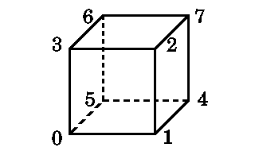

# Représentation d’un objet en 3D

## Le monde en 3 dimensions

Modéliser un objet de la réalité revient a considérer ses coordonnées spatiales.
Aussi, dessiner un objet en 3D peut ne pas paraître simple au premier abord.
Selon le problème, les structures utilisées peuvent différer.
Nous allons donc nous limiter à une seule représentation, la plus intuitive et très certainement la plus simple à mettre en oeuvre, qui est une représentation hiérarchique.

Nous allons travailler dans le repère cartésien $`(O,X,Y,Z)`$ qui sera notre espace image.
Un objet 3D est caractérisé par sa forme et sa position.
La forme d’un objet est définie par un ensemble de facettes planes, et une face est logiquement définie par les coordonnées de ses sommets.
En général, les coordonnées sont exprimées par rapport au centre de l’objet.
Ce centre est utilisé comme centre de rotation de l’objet.

Ainsi, la position d’un objet dans notre espace image est définie d’une part par les coordonnées de son centre, et d’autre part par son orientation dans l’espace.
Ceci nous mène donc naturellement à utiliser un vecteur de translation $`(Xoff,Yoff,Zoff)`$ et trois angles de rotation distincts (un pour chaque axe).

Pour déterminer la position d’un objet, nous devons connaître les coordonnées de chacun des sommets qui composent ses faces.
En pratique, un même sommet est commun à plusieurs faces.
C’est pourquoi, afin de ne pas recalculer plusieurs fois les mêmes coordonnées, nous ne travaillons qu’avec des points.
Au lieu d’avoir une liste de coordonnées $`(x,y,z)`$ pour représenter nos faces, nous n’aurons qu’une simple liste de numéros référençant les points de l’objet.

## Un exemple simple

Avant d’aller plus loin, prenons un des objets le plus élémentaire en 3D : le Cube.
Pour un cube de coté 200 centré sur l’origine, nous pouvons définir ses sommets de la manière suivante :

|Point #|X|Y|Z|
|---|---|---|---|
|0|-100|-100|-100|
|1|100|-100|-100
|2|100|100|-100|
|3|-100|100|-100|
|4|100|-100|100|
|5|-100|-100|100|
|6|-100|100|100|
|7|100|100|100|

Pour les faces, nous pouvons utiliser la structure suivante :\

|Nb de sommets|Liste des points|
|---|---|
|4|0,1,2,3|
|4|1,4,7,2|
|4|4,5,6,7|
|4|5,0,3,6|
|4|5,4,1,0|
|4|3,2,7,6|

L’objet est définit comme ci-dessous :



Vous pouvez dès à présent remarquer que les numéros des sommets sont donnés de manière à décrire chaque face dans un sens précis.
Dans notre exemple, lorsqu’on regarde une face, ses sommets sont numérotés dans le sens trigonométrique.

## Un premier programme

Bien.
Tout cela est bien joli, mais en pratique qu’est-ce que ça donne ?
Voici un petit programme qui ouvre un écran graphique et qui affiche un cube en perspective ([cube1.zip](src/cube1.zip)).
Pour ce faire, nous utilisons une projection, qui est le seul moyen de représenter un objet 3D en 2D.
Le principe sera expliqué dans le chapitre suivant.

Avant toute chose, il faut définir les sommets du cube.
On peut réaliser cette opération de plusieurs manières, soit statiquement, soit dynamiquement.
La structure utilisée est des plus simples :

```C
typedef struct Point Point;
struct Point
{
  double x;
  double y;
  double z;
};
```

Pour les sommets, nous pouvons les définir de la manière suivante :

```C
Point cube1[8] = {0};
```

puis faire appel à une fonction qui affectera une valeur a chacun de points :

```C
void
Initialiser(void)
{
  cube1[0].x = -100;  cube1[0].y = -100;  cube1[0].z = -100;
  cube1[1].x =  100;  cube1[1].y = -100;  cube1[1].z = -100;
  cube1[2].x =  100;  cube1[2].y =  100;  cube1[2].z = -100;
  cube1[3].x = -100;  cube1[3].y =  100;  cube1[3].z = -100;
  cube1[4].x =  100;  cube1[4].y = -100;  cube1[4].z =  100;
  cube1[5].x = -100;  cube1[5].y = -100;  cube1[5].z =  100;
  cube1[6].x = -100;  cube1[6].y =  100;  cube1[6].z =  100;
  cube1[7].x =  100;  cube1[7].y =  100;  cube1[7].z =  100;
}
```

Nous pouvons également initialiser les valeurs de chacune des coordonnées lors de la déclaration du vecteur des sommets :

```C
Point cube2[8]= { -100,-100,-100,
                   100,-100,-100,
                   100, 100,-100,
                  -100, 100,-100,
                   100,-100, 100,
                  -100,-100, 100,
                  -100, 100, 100,
                   100, 100, 100 };
```

Pour afficher tous les sommets de notre cube, nous devons transformer leurs coordonnées 3D en coordonnées 2D, ce qui revient à faire une projection.
Le principe en est simple : il suffit de diviser les valeurs $`X`$ et $`Y`$ de chaque point par la troisième valeur $`Z`$.
Nous avons alors une *projection perspective*.
Voici un petit schéma simple qui va vous éclairer l’esprit sur ce principe fondamental en 3D :


```math
\frac{d}{Z} = \frac{Y’}{Y} \leftarrow Y’ = \frac{d \times Y}{Z}
```

Vous constatez qu’il est simple de calculer la valeur de $`Y’`$.
Il en est de même pour $`X’`$.
Si vous ne comprenez pas ce principe, reprenez vos cours de math de 4ème, c’est au programme !

En pratique, il est avantageux de choisir pour valeur de $`d`$ une puissance de 2 : cela permet de remplacer une multiplication par un simple décalage arithmétique, beaucoup moins coûteux en temps machine (même si cette tendance disparaît peu à peu).
Voici une procédure C qui affiche chacun des points du cube en blanc :

```C
void
Sommet1(void)
{
  _setcolor(15);

  for (size_t i = 0; i < 8; ++i)
  {
    _setpixel((cube1[i].x*256)/(cube1[i].z+Zoff)+Xoff,
              (cube1[i].y*256)/(cube1[i].z+Zoff)+Yoff);
  }
}
```

Si vous utilisez un autre compilateur que le Watcom C, vous devrez bien sur remplacer les instructions `_setcolor()` et `_setpixel()` par les fonctions similaires disponibles, ou bien encore par votre propres fonctions, comme nous le verrons plus tard.

Une manière bien plus visuelle d’afficher notre cube serait de le dessiner en fil de fer.
Rien de plus simple : il suffit de tracer les arêtes entre les sommets projetés sur le plan de l’écran.
En reprenant le schéma de notre cube, cela devient un jeu d’enfant :

```C
void
FilDeFer(void)
{
  _setcolor(15);

  // On affiche la face avant
  ligne(0,1);
  ligne(1,2);
  ligne(2,3);
  ligne(3,0);

  // Puis la face arrière
  ligne(4,5);
  ligne(5,6);
  ligne(6,7);
  ligne(7,4);

  // Et enfin les arêtes restantes
  ligne(0,5);
  ligne(1,4);
  ligne(2,7);
  ligne(3,6);
}
```

Voilà pour notre premier programme consistant à afficher un objet 3D.

Vous pouvez retrouver les sources et l’exécutable MS-DOS dans [cube1.zip](src/cube1.c)

