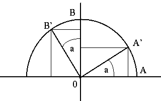
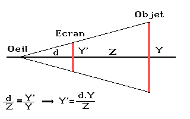
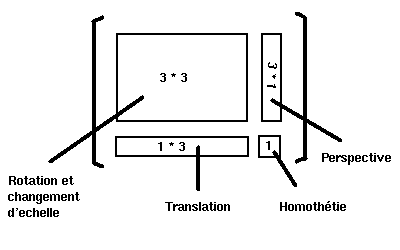

# Les transformations géométriques

La programmation en 3D est rarement limitée à des objets immobiles, en particulier dans le domaine des démos.
Tout mouvement peut se décomposer en une translation et une rotation, et dans le cas échéant on peut inclure le changement d’échelle.
Les objets subissent donc un certain nombre de transformations géométriques, afin de donner une illusion de mouvement.
Ces transformations ne sont pas très compliquées d’un point de vue mathématiques, et elles sont de plus en plus câblées sur de nombreux processeurs (par exemple sur les Silicon Graphics) mais il est tout de même bon de les présenter clairement, car vous serez très certainement amené à les programmer.

## La translation

On appelle translation un déplacement simple dans une direction fixe.
Elle est matérialisée par une addition vectorielle, tout simplement.
Par exemple, pour déplacer un point $`P(x,y)`$ de $`dx`$ unités selon l’axe des x et de $`dy`$ unités par rapport à l’axe des y il suffit de faire :

```math
x’ = x + dx

y’ = y + dy
```

Le point $`P’(x’,y’)`$ sera donc le point obtenu par la translation de vecteur $`T(dx,dy)`$.
En 3D, il suffit d’ajouter une dimension : le fonctionnement est strictement identique.
En résumé, la translation peut s’écrire sous la forme :

```math
P’ = P + T
```

Pour déplacer un objet par une translation, il suffit d’appliquer la même transformation à tous ses points.

## Le changement d’échelle

On peut effectuer aussi facilement un changement d’échelle sur un objet, ce qui permet de le « grossir » ou au contraire de le « rétrécir ».
Dans ce cas, il faut faire une multiplication de la forme :

```math
x’ = sx \times x
```

```math
y’ = sy \times y
```

Le point $`P’(x’,y’)`$ sera le point obtenu par la multiplication du point $`P`$ et de la matrice $`S(sx,sy)`$.
On écrira donc $`P’= S \cdot P`$, où $`S`$ est une matrice du type :

```math
S = \begin{bmatrix} Sx & 0 \\ 0 & Sy \end{bmatrix}
```

## La rotation

Contrairement aux idées reçues, les calculs de rotations ne sont pas très compliqués, pour peu que l’on ait des vagues souvenirs de trigonométrie et que l’on sache manipuler les matrices.

Plaçons-nous dans le plan avec l’exemple suivant :



Nous avons ici une rotation d’angle a autour de l’origine.
En supposant que les points $`A`$ et $`B`$ soient sur le cercle trigonométrique (pour ceux qui aurait oublié : $`A(1,0)`$ et $`B(0,1)`$), nous avons clairement :

```math
x_{A’} = cos(a) \quad \text{et} \quad x_{B’} = -sin(a)
```

```math
y_{A’} = sin(a) \quad \text{et} \quad y_{B’} = cos(a)
```

Cette opération n’est autre qu’un calcul matriciel, et vous devez certainement savoir comment l’effectuer.
La rotation matrice de la rotation $`R`$ d’angle $`a`$ est donc :


```math
R = \begin{bmatrix} cos(a) & -sin(a) \\ sin(a) & cos(a) \end{bmatrix}
```

On peut maintenant généraliser le problème à tous les points du plan en utilisant cette matrice $`R`$.
La rotation d’un point $`P`$ autour de l’origine devient alors :

```math
x’ = x \times cos(a) - y \times sin(a)
```

```math
y’ = x \times sin(a) + y \times cos(a)
```

Pour passer en 3D, rien de plus facile : il suffit d’ajouter une dimension à notre matrice.
Dans une rotation, il est important de distinguer les axes concernés ; aussi nous allons voir la matrice associée à la rotation autour de chaque axe.
Commençons par la rotation autour de l’axe des X : il est clair que nous pouvons déduire la matrice à partir de celle que nous venons de voir.
Il suffit pour cela d’observer que la rotation autour de l’axe des X ne modifiera pas les composantes X des coordonnées du point considéré (où de l’objet).

Voici l’allure qu’auront nos matrices pour une rotation respectivement autour des des axes X, Y et Z :

```math
R_{x} = \begin{bmatrix} 1 & 0 & 0 \\ 0 & cos(a) & -sin(a) \\ 0 & sin(a) & cos(a) \end{bmatrix}
\begin{equation}
  x+y+z = 1,
  x+y+z = \frac{5}{2},
  x+y+z = 5
\end{equation}
```

```math
R_{y} = \begin{bmatrix} cos(a) & 0 & -sin(a) \\ 0 & 1 & 0 \\ sin(a) & 0 & cos(a) \end{bmatrix}
```

```math
R_{z} = \begin{bmatrix} cos(a) & -sin(a) & 0 \\ sin(a) & cos(a) & 0 \\ 0 & 0 & 1 \end{bmatrix}
```


+-----------------------------------+-----------------------------------+
|            | **x’ = x**                       |
|                                   |                                   |
|                                   | **y’ = y\*cos(a) - z\*sin(a)**   |
|                                   |                                   |
|                                   | **z’ = y\*sin(a) + z\*cos(a)**   |
+-----------------------------------+-----------------------------------+
| {height="150"  | **x’ = x\*cos(a) + z\*sin(a)**   |
| width="200"}                      |                                   |
|                                   | **y’ = y**                       |
|                                   |                                   |
|                                   | **z’ = -x\*sin(a) + z\*cos(a)**  |
+-----------------------------------+-----------------------------------+
| {height="150"  | **x’ = x\*cos(a) + y\*sin(a)**   |
| width="200"}                      |                                   |
|                                   | **y’ = -x\*sin(a) + y\*cos(a)**  |
|                                   |                                   |
|                                   | **z’ = z**                       |
+-----------------------------------+-----------------------------------+

Voilà pour nos rotations.
Mais, me direz-vous, pourquoi se promener avec 3 matrices, et non pas une seule ? En fait, le problème est un petit peu plus compliqué que ça, et l’on en reparlera un peu plus tard lorsque nous verrons les matrices homogènes.
On peut en effet n’avoir qu’une seule matrice : il suffit de les combiner entre elles.
Il s’agit encore une fois d’un simple produit matriciel, mais je ne vous donnerez pas la formule, elle est trop longue pour tenir sur une seule ligne :o) Si vous etes courageux je vous laisse le soin de la trouver.

A ce niveau, vous pouvez déjà réaliser toutes les animations que vous voulez, puisque nous avons abordé toutes les bases mathématiques nécessaires.
Mais il nous reste encore un problème à résoudre : comment afficher une objet représenté en 3D sur un petit écran tout plat qui ne compte lui que 2 dimensions ? Rassurez-vous, la solution est relativement simple, et si vous avez suivit jusque-là cela ne vous causera en principe pas de problème particulier.

## La projection

Pour passer d’une dimension 3 à une dimension 2, il faut projeter les coordonnées des sommets qui composent la scène à visualiser.
Il existe plusieurs types de projection : la *projection parallèle* et la *projection perspective.* La première est utilisée en architecture, alors que le seconde est utilisée pour le rendu réaliste, car elle rend compte des distances et donne véritablement une impression de profondeur à la scène.
C’est celle que nous avons vue dans le chapitre précédent, et que nous allons utiliser par la suite.

Dans ce cas de figure, le principe consiste à projeter les points sur un plan situé devant le point d’observation.
Reprenons notre petit schéma :



Vous constatez qu’il est simple de calculer la valeur de Y’.
Il en est de même pour X’.
Il s’agit ici d’une formule simplifiée pour nos besoins, et qui va s’avérer très rapide est efficace, mais qui risque de nous limiter.
Donc si jamais vous avez besoin un jour d’un vrai formules de projection perspective, vous avez de la chance les voici :

**X’ = Xo + Zo \* (X-Xo) / (Zo-Z)**

**Y’ = Yo + Zo \* (Y-Yo) / (Zo-Z)**

Ces formules tiennent compte de la position de l’observateur, qui est situé au point **O(Xo,Yo,Zo)**.
En supposant que l’on ait Xo=Yo=0, on a l’oeil qui est situé quelque par sur l’axe des Z, et l’on retombe sur les formules précédentes.
C’est une petite optimisation qui simplifie la vie des débutants, mais qui n’est pas valable dans le cas général.

Comme vous l’avez certainement constaté, le dessin en 2D n’est pas réellement mon domaine de prédilection.
Je ne vais donc pas vous faire de petit dessin pour illustrer mes formules, d’autant qu’elles sont compréhensibles.

## Les coordonnées homogènes

Les coordonnées homogènes sont utilisées en synthèse d’image afin d’unifier le traitement des transformations géométriques d’une scène et de les regrouper dans une seule matrice.
En effet, si l’on utilise une matrice 2\*2 pour les scènes bidimensionnelles et une matrice 3\*3 pour les scènes tridimensionnelles, ces matrices ne peuvent exprimer que des rotations.

Pour exprimer aussi les translations, les changements d’échelle et les projections, on va utiliser des matrices 4\*4 pour les scènes tridimensionnelles.

Ainsi, si (x,y,z) sont les coordonnées d’un point de la scène à transformer et M~H~ la matrice 4\*4 de coordonnées homogènes, on effectuera la multiplication :

**M~H~ \* \[ x y z 1 \]**

ce qui donnera comme résultat \[ X Y Z H \].

Les coordonnées du point transformé seront alors (X/H , Y/H , Z/H).

La matrice 4\*4 des coordonnées homogènes peut être considérée comme étant composée de 4 sous-matrices, chacune d’elle étant associée à un type de transformation.



