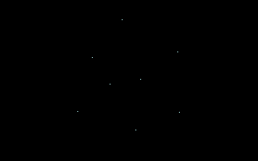
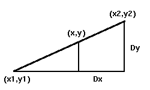
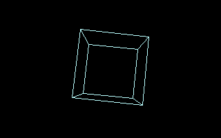
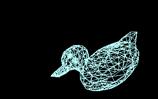

# Mise en pratique

Maintenant que nous disposons d’un bon nombre d’éléments mathématiques nécessaires à la synthèse d’image 3D, il est temps de passer à une application concrète.
Pour cela, nous allons reprendre le cube de notre premier exemple, et lui appliquer les transformations géométriques que nous venons de découvrir au chapitre précédent.

## Les outils graphiques nécessaires

Toutes les séquences de code présentées sont entièrement portables, si ce n’est les primitives graphiques (initialisation du mode graphique, affichage d’un pixel…).
Aussi, afin de pousser encore un peu plus la portabilité de mes programmes, je vais utiliser un écran virtuel dans lequel on dessinera la scène à afficher.
Ainsi, la seule fonction non portable est celle qui effectue le transfert de cette zone mémoire vers la zone d’écran.
Il est donc relativement simple d’adapter les programmes à n’importe quel type de machine.

A titre d’illustration, l’ensemble de ces primitives a été regroupé dans un fichier séparé, [graphics.c.](src/graphics.c) A ce niveau, il n’est pas nécessaire de se soucier de la manière dont cela est géré, même si c’est relativement simple.
Par la suite, dans un soucis d’optimisation, il faudra pouvoir accéder directement à l’écran virtuel sans passer par des primitives.

## Animation des sommets d’un cube

Comme la plus grande majorité des débutants en 3D, nous allons commencer par animer les sommets d’un cube.
Partant de cela, il est possible d’animer n’importe quel type d’objet.
Il y aura cependant de nouveaux éléments à acquérir pour pouvoir afficher correctement des objets aux faces pleines, chose que nous verrons dans un chapitre suivant.
Les sources complètes sont disponibles dans [cube2.zip](src/cube2.zip).

Une des étapes essentielles à l’animation est la rotation des sommets.
Maintenant que nous savons comment cela fonctionne, nous allons écrire une fonction.

```C
void
Rotation(int Xa, int Ya, int Za)
{
  // Calcul de la matrice de rotation 3*3

  matrice[0][0] = Cos[Za] * Cos[Ya];
  matrice[1][0] = Sin[Za] * Cos[Ya];
  matrice[2][0] = -Sin[Ya];

  matrice[0][1] = Cos[Za] * Sin[Ya] * Sin[Xa] - Sin[Za] * Cos[Xa];
  matrice[1][1] = Sin[Za] * Sin[Ya] * Sin[Xa] + Cos[Xa] * Cos[Za];
  matrice[2][1] = Sin[Xa] * Cos[Ya];

  matrice[0][2] = Cos[Za] * Sin[Ya] * Cos[Xa] + Sin[Za] * Sin[Xa];
  matrice[1][2] = Sin[Za] * Sin[Ya] * Cos[Xa] - Cos[Za] * Sin[Xa];
  matrice[2][2] = Cos[Xa] * Cos[Ya];

  // Rotation des sommets de l'objet
  for (size_t i = 0; i < Nb_points; i++)
  {
    Point3D[i].x = matrice[0][0] * Sommet[i].x +
                   matrice[1][0] * Sommet[i].y +
                   matrice[2][0] * Sommet[i].z;

    Point3D[i].y = matrice[0][1] * Sommet[i].x +
                   matrice[1][1] * Sommet[i].y +
                   matrice[2][1] * Sommet[i].z;

    Point3D[i].z = matrice[0][2] * Sommet[i].x +
                   matrice[1][2] * Sommet[i].y +
                   matrice[2][2] * Sommet[i].z;
  }
}

```

Comme vous pouvez le constater, nous calculons au préalable la matrice de rotation, et ensuite nous transformons chaque sommet.
Si l’on ne tient pas compte de l’étape de calcul de la matrice, cela nous fera ensuite 9 multiplications par sommets.
Si on n’utilisait pas de matrice, nous aurions 12 multiplications par sommet.
Sachant qu’un objet 3D peut contenir plusieurs milliers, voire dizaines de milliers de sommets, le gain n’est pas si négligeable que cela.

Il est possible d’améliorer encore cette rotation.
Une méthode bien connue de tous aujourd’hui permet de descendre à 6 multiplications par sommets.
Pour arriver à ce résultat il suffit de factoriser de façon judicieuse.
Je ne vais pas vous faire de démonstration, je vous donne simplement la fonction correspondante.
A titre d’indication, je n’ai pas noté de gain notable sur ma machine, mais les fous d’optimisation y trouveront leur compte.
Sachez aussi que l’on peut encore réduire le nombre de multiplications.

```C
    void Rotation6Mul(int Xa, int Ya, int Za)
    {
      int i;
      float a[3];

      matrice[0][0] = Cos[Za]*Cos[Ya];
      matrice[1][0] = Sin[Za]*Cos[Ya];
      matrice[2][0] = -Sin[Ya];

      matrice[0][1] = Cos[Za]*Sin[Ya]*Sin[Xa] - Sin[Za]*Cos[Xa];
      matrice[1][1] = Sin[Za]*Sin[Ya]*Sin[Xa] + Cos[Xa]*Cos[Za];
      matrice[2][1] = Sin[Xa]*Cos[Ya];

      matrice[0][2] = Cos[Za]*Sin[Ya]*Cos[Xa] + Sin[Za]*Sin[Xa];
      matrice[1][2] = Sin[Za]*Sin[Ya]*Cos[Xa] - Cos[Za]*Sin[Xa];
      matrice[2][2] = Cos[Xa]*Cos[Ya];

      a[0]=-(matrice[0][1]*matrice[0][0]);
      a[1]=-(matrice[1][1]*matrice[1][0]);
      a[2]=-(matrice[2][1]*matrice[2][0]);

      for(i=0;i<Nb_points;i++)
      {
        Point3D[i].x =   (matrice[0][1]+Sommet[i].x)
                       * (matrice[0][0]+Sommet[i].y)
                       + a[0] + Sommet[i].xy
                       + matrice[0][2]*Sommet[i].z;

        Point3D[i].y =   (matrice[1][1]+Sommet[i].x)
                       * (matrice[1][0]+Sommet[i].y)
                       + a[1] + Sommet[i].xy
                       + matrice[1][2]*Sommet[i].z;

        Point3D[i].z =   (matrice[2][1]+Sommet[i].x)
                       * (matrice[2][0]+Sommet[i].y)
                       + a[2] + Sommet[i].xy
                       + matrice[2][2]*Sommet[i].z;
      } 
    }
```

Il faut ajouter un nouveau champ à chaque sommet, appelé ici `Sommet[i].xy`.
Cette valeur doit être initialisée au début du programme et n’a pas besoin d’être recalculée par la suite.

```C
    Sommet[i].xy = - Sommet[i].x*Sommet[i].y;
```

Après avoir fait la rotation de chacun des sommets de notre joli petit cube, il nous faut encore les projeter sur notre écran.
Pour simplifier le code (et l’optimiser un tout petit peu), nous allons placer l’observateur dans l’axe exact de l’objet (face au centre de l’écran).

```C
    void Projection(void)
    {
      int i;

      for(i=0;i<Nb_points;i++)
      {
        Point2D[i].x=(Point3D[i].x<<8)/(Point3D[i].z+Zoff)+Xoff;
        Point2D[i].y=(Point3D[i].y<<8)/(Point3D[i].z+Zoff)+Yoff;
      }
    }
```

Comme vous le voyez, rien de bien compliqué, surtout si vous avez compris les justifications mathématiques.

Il ne nous reste plus qu’à afficher le tout à l’écran, sinon ça risque de ne pas donner grand chose :o)

```C
    void Afficher(int couleur)
    {
      int i;

      /* On efface le contenu de l'ecran virtuel */
      ClearBuffer();

      /* On dessine dedans */
      for (i=0;i<8;i++)
        PutPixel(Point2D[i].x,Point2D[i].y,couleur);

      /* On affiche le tout a l'ecran, en synchonisant */
      WaitVbl();
      ShowBuffer();
    }
```

En fait, on ne fait qu’afficher tous les sommets du cube.
Étant donné qu’on utilise un écran virtuel, il faut effacer son contenu avant de commencer à dessiner dedans.
Ensuite, on dessine chaque sommet dans le buffer, et on affiche le tout.
On attend cependant le retour du faisceau vertical qui balaie l’écran, afin d’éviter tout effet de « flic ».

Enfin il ne reste plus qu’à gérer cette animation.
Nous allons tout simplement faire tourner notre cube autour du centre de l’écran.
Ce n’est certes pas très extraordinaire, mais c’est très simple à faire :

```C
      /* Animation de note cube jusqu'a pression d'une touche */
      while(!kbhit())
      {
        Rotation(xa,ya,za);
        Projection();
        Afficher(100);
        xa=(xa+1)%360;
        ya=(ya+3)%360;
        za=(za+1)%360;
      }
```



*Les sommets du cube en pleine animation*

Et voilà !Nous venons de faire notre première animation 3D.
Vous retrouverez les sources et l’exécutable dans [cube2.zip](src/cube2.zip).
Pour compiler chez vous, vous pouvez faire un Makefile, ou encore taper simplement :

```Bash
wcl386 cube2.c graphics.c
```

## Un algorithme de tracé de ligne

Bien que cela ne soit pas propre à la synthèse d’image tridimensionnelles, il est tout de même important de savoir comment tracer une droite sur un écran, surtout lorsqu’on veut afficher un objet en fil de fer.
Pour cela, il existe de nombreux algorithmes bien éprouvés.
Le plus célèbre est celui de Bresenham, et c’est aussi le meilleur.
Vous trouverez cet algorithme sur de nombreux sites et dans beaucoup d’ouvrages dédiés à la synthèse d’image.
Il s’agit d’une méthode incrémentale.

Le but d’un tel algorithme est d’approcher le segment réel par un ensemble de points allumés.
Tout reste à savoir quels pixels allumer.

Si $`(x1,y1)`$ sont les coordonnées du début du segment à afficher et $`(x2,y2)`$ ses coordonnées de fin, on va poser :

```math
Dx = | x2 - x1 | \quad \text{et} \quad Dy = | y2 - y1 |
```

Pour le moment, supposons que $`Dy < Dx`$ et que $`x1 < x2`$.

La pente du segment à afficher est donnée par $`\frac{Dy}{Dx}`$.
La méthode utilisée consiste à allumer des points dans une seule direction, ici la direction $`x`$, et n’allumer de points dans la direction $`y`$ que si l’erreur entre la pente obtenue et la pente idéale dépasse un certain seuil.
Ainsi, si $`(x,y)`$ sont les coordonnées du point courant (en cours d’affichage), on aura en arithmétique réelle :

```C
    pente = Dy/Dx
    y = y1
    pour x variant de x1 à x2
    {
       afficher(x,arrondi(y))
       y = y + a
    }
```



On voit que l’on a $`y = y1 + (x-x1) \times \frac{Dy}{Dx}`$.
Comme on allume les points dans la direction x, on aura $`x_{i+1} = x_{i} + 1`$ ce qui donnera $`y_{i+1} = y_{i} + \frac{Dy}{Dx}`$
ce qui fait que l’erreur commise si l’on allume un point dans la direction x est de $`\frac{Dy}{Dx}`$

L’erreur est cumulée dans une variable.
À chaque fois on l’incrémente de $`\frac{Dy}{Dx}`$ et l’on commence à allumer des points dans l’autre direction dès que l’erreur dépasse la valeur 1.
Pour éviter d’avoir des réels, on utilisera $`Dy`$ comme pente au lieu de $`\frac{Dy}{Dx}`$ (on a multiplié par $`Dx`$) et au lieu de tester avec la valeur 1, le test se fera avec $`Dx (1 \times Dx)`$.

Voilà la fonction C qui tient compte de tous les cas de figures possibles :

```C
    void Line(int x1,int y1, int x2,int y2, int couleur)
    {
      int x,y;
      int Dx,Dy;
      int xincr,yincr;
      int erreur;
      int i;

      /* On initialise nos variables */
      Dx = abs(x2-x1);
      Dy = abs(y2-y1);

      if(x1<x2)
        xincr = 1;
      else
        xincr = -1;

      if(y1<y2)
        yincr = 1;
      else
        yincr = -1;

      /* Trace de ligne */
      x = x1;
      y = y1;
      if(Dx>Dy)
        {
          erreur = Dx/2;     /* c'est plus esthetique comme ca */
          for(i=0;i<Dx;i++)
            {
              x += xincr;
              erreur += Dy;
              if(erreur>Dx)
                {
                  erreur -= Dx;
                  y += yincr;
                }
              PutPixel(x,y,couleur);
            }
        }
      else
        {
          erreur = Dy/2;     /* c'est plus esthetique comme ca */
          for(i=0;i<Dy;i++)
            {
              y += yincr;
              erreur += Dx;
              if(erreur>Dy)
                {
                  erreur -= Dy;
                  x += xincr;
                }
              PutPixel(x,y,couleur);
            }
        }
    }
```

## Représentation filière (fil de fer)

A présent nous pouvons afficher notre cube en fil de fer, sans tenir compte pour le moment des faces cachées ([cube3.zip](src/cube3.zip)).
Pour cela, il suffit d’afficher chaque arête de chacune des faces.
On s’aperçoit donc que certaines arêtes sont affichées plusieurs fois, ce qui est inutile.
Pour remédier à ce problème, il faut en principe ajouter des informations supplémentaires à nos facettes, pour dire quelles sont les arêtes à afficher.
Faire ce travail à la main est en général très laborieux, aussi il est bon d’utiliser des objets provenants d’un modeleur.
Pour l’instant, notre cube est assez simple pour faire ce travail manuellement.

```C
    void FilDeFer(int couleur)
    {
     /* On affiche la face avant */
     ligne(0,1,couleur); ligne(1,2,couleur);
     ligne(2,3,couleur); ligne(3,0,couleur);

     /* Puis la face arriere */
     ligne(4,5,couleur); ligne(5,6,couleur);
     ligne(6,7,couleur); ligne(7,4,couleur);

     /* Et enfin les arêtes restantes */
     ligne(0,5,couleur);
     ligne(1,4,couleur);
     ligne(2,7,couleur);
     ligne(3,6,couleur);
    }
```

La fonction `ligne()` est là pour simplifier le code et le rendre plus lisible :

```C
    void ligne(int a, int b, int couleur)
    {
      Line(Point2D[a].x,Point2D[a].y,Point2D[b].x,Point2D[b].y,couleur);
    }
```



*Le cube en fil de fer*

Les sources complètes et l’exécutables sont disponibles dans [cube3.zip](src/cube3.zip).

## Charger des objets de 3D Studio

Les cubes, c’est vrai que c’est idéal pour débuter, mais ça devient vite lassant.
Je vais donc vous proposer une fonction ([objet.zip](src/objet.zip)) qui va vous permettre de manipuler dans vos programmes des objets provenant d’un logiciel bien connu, le modeleur de 3D Studio.
Nous allons en particulier nous intéresser au format `.ASC`, qui est le format ascii de 3DS.
Ce format est en effet très simple à gérer, en plus des nombreux avantages qu’il peut apporter.

Je ne vais pas vous décrire en détail le format en question, puisque je fournit les sources nécessaires pour charger les objets.
De plus, les fichiers sauvés à ce format sont parfaitement lisibles, et vous n’aurez en principe aucun mal à comprendre le format et à le gérer vous-même.

Rapidement, les objets sont formés uniquement de facettes triangulaires, et un fichier peut contenir plusieurs objets.
Après la liste des points et de leur coordonnées X, Y et Z (éventuellement U et V pour les textures) on trouve la liste des facettes.
Voici un exemple de « loader » de fichier `.ASC` :

```C
    /************************************************************************/
    /* ChargerASC() : charge en memoire un objet au format .asc             */
    /*                (format ascii de 3DS)                                 */
    /*                La memoire n'est pas allouee dynamiquement dans un    */
    /*                soucis de lisibilite (programme a but pedagogique     */
    /************************************************************************/

    void ChargerASC(char *nom)
    {
      FILE  *fichier;
      char  chaine[200];
      char  *fin;
      int   i,j;
      char  temp[50];
      float x,y,z;
      int   a,b,c;

      int decalage=0;

      if ((fichier = fopen(nom,"rt"))==NULL)
      {
        perror("Impossible d'ouvrir le fichier en lecture");
        exit(-2);
      }

      do
      {
        // On lit le fichier contenant les informations sur l'objet
        fin=fgets(chaine,100,fichier);
        if (!strncmp(chaine,"Vertex",6))
        {
          if (strncmp(chaine,"Vertex list",11))
          {
            // Lecture des coordonnées d'un point
            i=0;

            while(chaine[i]!='X') i++;
            i+=2;
            while(chaine[i]==' ') i++;
            sscanf(chaine+i,"%f",&x);

            while(chaine[i]!='Y') i++;
            i+=2;
            while(chaine[i]==' ') i++;
            sscanf(chaine+i,"%f",&y);

            while(chaine[i]!='Z') i++;
            i+=2;
            while(chaine[i]==' ') i++;
            sscanf(chaine+i,"%f",&z);

            Sommet[Nb_points].x=x;
            Sommet[Nb_points].y=y;
            Sommet[Nb_points].z=z;

            Nb_points++;
          }
        }
        else
        {
          if (!strncmp(chaine,"Face",4))
          {
            if (strncmp(chaine,"Face list",9))
            {
              // Lecture d'une facette
              i=j=0;
              while(chaine[i]!='A') i++;
              i+=2;
              j=i;
              while(chaine[j]!=' ') j++;
              strncpy(temp,chaine+i,j-i);
              temp[j-i]=0;
              Facette[Nb_faces].a=atoi(temp)+decalage;

              while(chaine[i]!='B') i++;
              i+=2;
              j=i;
              while(chaine[j]!=' ') j++;
              strncpy(temp,chaine+i,j-i);

              temp[j-i]=0;
              Facette[Nb_faces].b=atoi(temp)+decalage;

              while(chaine[i]!='C') i++;
              i+=2;
              j=i;
              while(chaine[j]!=' ') j++;
              strncpy(temp,chaine+i,j-i);
              temp[j-i]=0;
              Facette[Nb_faces].c=atoi(temp)+decalage;

              // Lecture des aretes visibles
              while(chaine[i]!='A') i++;

              strncpy(temp,chaine+i+3,1);
              temp[j-i]=0;
              Facette[Nb_faces].ab=atoi(temp);

              strncpy(temp,chaine+i+8,1);
              temp[j-i]=0;
              Facette[Nb_faces].bc=atoi(temp);

              strncpy(temp,chaine+i+13,1);
              temp[j-i]=0;
              Facette[Nb_faces].ac=atoi(temp);

              Nb_faces++;
            }
          }
          else
            if (!strncmp(chaine,"Named object",12))
              decalage=Nb_points;
        }
      } while(fin!=NULL);


      fclose(fichier);
    }
```

Bien entendu, vous pouvez retrouver un exemple de programme utilisant cette fonction dans [objet.zip](src/objet.zip).
Pour lancer l’executable, vous pouvez taper par exemple :

**objet `duck.asc`**



*Un petit canard en pleine rotation*

Le fichier `duck.asc` est un exemple fournit avec l’exécutable : vous pourrez ainsi faire tourner vous-même ce fameux petit canard si bien connu.

Le programme charge en mémoire les coordonnées de chacun des sommets, et affiche ensuite toutes les arêtes de l’objet.
Ici, nous tenons compte du fait qu’une arête est visible ou non, puisque cette information est présente dans le format `.ASC`.

Par la suite, nous utiliserons ce type d’objets pour les programmes d’application.

