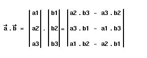
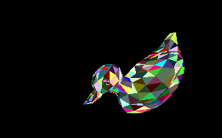

# Les objets à faces pleines

Nos objets commencent à prendre de l’allure, mais ils sont toujours en fil de fer.
Pour passer à l’étape suivante et éliminer les parties cachées, nous devons commencer par apprendre à remplir des polygones.
Dans notre cas, nous nous limiterons aux polygones convexes, ce qui est largement suffisant en 3D.
D’ailleurs, vu que nous gérons à présent uniquement des objets de 3DS, nous sommes surs que nous n’aurons que des triangles à remplir.
Cependant, les fonctions fournies permettront de remplir n’importe quel type de polygones convexe, mais libre à vous de les optimiser.

## Remplissage de polygones

Si nous nous limitons aux polygones convexes, c’est qu’il y a une bonne raison.
En effet, lorsque nous dessinons un polygone, nous traçons en fait des lignes horizontales.
Avec cette restriction, nous n’aurons besoin de stocker que l’abscisse de départ et de fin pour chaque ligne Y de l’écran.

Notre algorithme va donc devoir commencer par calculer la coordonnée X de début et de fin de la ligne horizontale pour chaque ligne Y.
Pour cela, nous allons modifier notre algorithme de tracé de droite, mais au lieu de dessiner des points, nous allons stocker la coordonnée x dans un tableau approprié.
Ensuite, nous n’aurons plus qu’à dessiner des lignes horizontales entre les coordonnées X qui auront été stockées ([objet3.zip](src/objet3.zip)).

Nous avons donc besoin de 2 tableaux pour stocker les coordonnées de départ et de fin pour chaque ligne horizontale :

```C
int startx[200];
int endx[200];
```

Nous n’avons besoin que de 200 éléments puisque nous travaillons en mode 320 par 200, 256 couleurs.
Si vous changer de mode,vous devrez changer la taille de ces tableaux.

Avant de dessiner un polygone, les valeurs de ces tableaux sont initialisées à des valeurs impossibles dans la réalité (j’utilise -16000, mais c’est totalement arbitraire).

Maintenant il faut modifier l’algorithme de tracé de droite, qui va stocker une valeur X pour chaque coordonnée Y.
Si la valeur contenue dans `startx[y]` vaut -16000, alors nous la stockons dans ce tableau, sinon cela signifie qu’une valeur y est déjà présente, et donc nous la mettons dans `endx[y]`.
Ainsi il ne peut pas y avoir de perte d’information si notre algorithme est bien conçu (je vous rassure, je pense que c’est le cas).

Voyons ce que cela donne concrètement :

```C
    void InitSegment(int x1, int y1, int x2,int y2)
    {
      int temp,y;
      long x,pas;

      if(y2!=y1)
      {
        if(y2<y1)
        {
          temp=y1;
          y1=y2;
          y2=temp;

          temp=x1;
          x1=x2;
          x2=temp;
        }

        x  = x1<<8;
        pas= ((x2-x1)<<8)/(y2-y1);

        x+=pas;
        y1++;

        if(y1<miny) miny=y1;
        if(y2>maxy) maxy=y2;

        for(y=y1;y<=y2;y++)
        {
          if((y>=0) && (y<Ymax))
            if(startx[y]==-16000)
              startx[y]=x>>8;
            else
              endx[y]=x>>8;
          x+=pas;
        }
      }
    }
```

Pour accélérer les calculs, nous travaillons en arithmétique entière.
En fait, nous utilisons des chiffres à virgule fixe.
L’abscisse **X** est multipliée par **256** et nous lui ajoutons à chaque étape la valeur **pas**, qui est une constante.
On ne calcule qu’une seule coordonnée X par ligne Y.

Ce type de calcul en virgule fixe peut être adapté à l’assembleur de façon très efficace, et fournir un code d’une rapidité assez étonnante.
Faites l’essai, le résultat en vaut le coût.

Du point de vue utilisateur, nous n’avons pas besoin d’appeler cette fonction.
Pour remplir un polygone, nous devons lui passer en paramètre un pointeur sur un tableau de point, le nombre de points du polygone et la couleur à utiliser.
Le reste est entièrement géré par la fonction `FillPoly()`. C’est elle qui fera appel à `InitSegment()` pour chacune des arêtes du polygone, et qui tracera les lignes horizontales.

```C
    void FillPoly(point *vertexlist, int numvertex, int color)
    {
      int i;
      point *curpt,*nextpt;

      miny=Ymax;
      maxy=0;

      /* On fait appel a InitSegment pour chaque arête */

      curpt  = vertexlist;
      nextpt = vertexlist+1;

      for(i=1;i<numvertex;i++)
      {
        InitSegment(curpt->x,curpt->y,nextpt->x,nextpt->y);
        curpt++;
        nextpt++;
      }

      nextpt = vertexlist;
      InitSegment(curpt->x,curpt->y,nextpt->x,nextpt->y);

      if(miny<0) miny=0;
      if(maxy>=Ymax) maxy=Ymax-1;

      /* On trace les lignes horizontales */

      for(i=miny;i<=maxy;i++)
        {
          if(endx[i]==-16000)
            PutPixel(startx[i],i,color);
          else
            Hline(startx[i],endx[i],i,color);

          startx[i]=endx[i]=-16000;
        }
    }
```

Au lieu de faire appel au tracé de droite classique, qui fonctionnerait parfaitement, il est préférable d’utiliser une fonction spécifique qui sera optimisée.
Il s’agit de la fonction `Hline()` :

```C
    void Hline(int x1,int x2,int y, int color)
    {
      int x,offset;

      if (y<0 || y>=Ymax) return;

      if(x1>x2)
        {
          x=x1;
          x1=x2;
          x2=x;
        }

      offset=y*320+x1;

      for(x=x1;x<=x2;x++)
        {
          if(x>=0 && x<Xmax)
            screen[offset]=color;
          offset++;
        }
    }
```

Rien de plus simple en somme.
Remarquez cependant que le test suivant

```C
if(x>=0 && x<Xmax)
```

permet de réaliser un clipping des plus primaires, mais efficace.

Voici un exemple d’utilisation de la fonction de remplissage de polygone :

```C
    void Remplir(face facette)

    {
      point p[3];

      p[0] = Point2D[facette.a];
      p[1] = Point2D[facette.b];
      p[2] = Point2D[facette.c];

      FillPoly(p,3,facette.couleur);
    }
```

## Les faces cachées

Avant de remplir chacune des facettes de notre objet 3D, nous devons éliminer celles qui ne sont pas visibles par l’observateur.
Dans le cas d’un objet convexe comme un cube ou une sphère, cela sera satisfaisant ([objet2.zip](src/objet2.zip)).
Pour des objets concaves, tels un tore ou le petit canard, il faudra en plus trier les facettes selon leur distance à l’observateur ([objet3.zip](src/objet3.zip)).

Étant donné les restrictions que nous avons fait sur la position de l’observateur, il nous est facile de calculer la visibilité d’une face.
Il suffit en effet de tester le signe de sa normale Pour obtenir la normale d’une face, il faut faire ce que l’on appelle un produit vectoriel : on associe à deux vecteurs un troisième qui leur est perpendiculaire.



```math
\overrightarrow{a} \cdot \overrightarrow{b} =

\begin{matrix}
a1 \\ a2 \\ a3
\end{matrix}

\cdot

\begin{matrix}
b1 \\ b2 \\ b3
\end{matrix}

=

\begin{matrix}
a1 & a2 & a3
\end{matrix}


```

Voilà ce que cela donne en C :

```C
    int Visible(face f)
    {
      long a1,a2,b1,b2;

      a1 = Point2D[f.a].x - Point2D[f.b].x;
      b1 = Point2D[f.a].y - Point2D[f.b].y;
      a2 = Point2D[f.c].x - Point2D[f.b].x;
      b2 = Point2D[f.c].y - Point2D[f.b].y;

      if ((a1*b2-b1*a2)<0) return 0;
      return 1;
    }
```

Il est possible d’éviter ce calcul en pré calculant la normale à chaque facette, et à lui faire subir les mêmes transformations qu’aux sommets (je pense aux rotations).
Dans ce cas, il suffirait de tester le signe de la composante Z de la normale.
Nous verrons comment faire lorsque l’on voudra illuminer nos objets.

En attendant, vous pouvez animer sans problème des objets convexes ([objet2.zip](src/objet2.c)) Cela marche aussi avec des objets concaves (ex duck.asc) mais il y a des parties que l’on voit et qui devraient être invisibles.
Une seule solution : remplir les polygones, et les afficher par ordre décroissant de leur distance à l’observateur.
On pourra ainsi
éliminer toutes les parties invisibles depuis le point d’observation ([objet3.zip](src/objet3.zip)).

## Trier les facettes

Pour tirer nos facettes, nous devons rajouter une information supplémentaire : la distance de cette facette à l’observateur, qui sera dans notre cas la distance z moyenne de la facette.

```C
    typedef struct
    {
      int a,b,c;
      unsigned char couleur;  /* couleur propre de la facette  */
      double z;               /* profonceur moyenne de la face */
    } face;

    point3D Sommet[1000];   
    point3D Point3D[1000];  
    point   Point2D[1000];  

    face    Facette[1000];  /* les facettes de l'objet      */
    int     tri[1000];      /* tableau trie des facettes    */

    int     Nb_points = 0;
    int     Nb_faces  = 0;
    int     Nb_visibles;    /* pour connaitre le nombre de faces visibles */
```

Nous utiliserons également un tableau `tri[]`, qui contiendra l’indice des facettes classées selon leur distance Z, ainsi qu’une variable `Nb_visible` pour connaître le nombre de facettes qui sont partiellement visibles.
Pour afficher notre objet, la fonction utilisée deviendra alors :

```C
    void Afficher(void)
    {
      int i;

      TrierFacettes();

      ClearBuffer();

      for(i=0;i<Nb_visibles;i++)
        Remplir(Facette[tri[i]]);

      WaitVbl();
      ShowBuffer();
    }
```

Pour trier les facettes, nous avons besoin de connaître la profondeur moyenne de chacune des faces composant la scène à afficher.
Il suffit donc de faire la somme de chacune des 3 composantes Z de chaque sommet.
Il est d’ailleurs inutile de diviser cette somme par 3, cela ne changera rien pour le tri.
Enfin, on tri le tableau des facettes **visibles** (pour ne pas afficher des facettes qui de toutes façon seront totalement recouvertes).
Personnellement, j’utilise un QuickSort pour sa rapidité et sa simplicité, mais vous pouvez utiliser votre procédure de tri si cela vous chante.

```C
    void TrierFacettes(void)
    {
      int i;

      Nb_visibles=0;

      for(i=0;i<Nb_faces;i++)
        if(visible(Facette[i]))
        {
          Facette[i].z =  Point3D[Facette[i].a].z
                        + Point3D[Facette[i].b].z
                        + Point3D[Facette[i].c].z;

          tri[Nb_visibles]=i;
          Nb_visibles++;
        }

      Quick_Sort(0,Nb_visibles-1);
    }
```

Toutes les sources et l’exécutable sont disponibles dans [objet3.zip](src/objet3.zip).
Pour l’utiliser, vous pouvez taper par exemple :

**objet3 duck.asc**



*Objet en faces pleines*

Les facettes sont affichées avec une couleur aléatoire qui est fixée lors du chargement de l’objet contenu dans le fichier .ASC.
Ce n’est pas très joli, mais maintenant vous maîtrisez parfaitement la 3D, et c’est déjà pas si mal !

```C
    /************************************************************************/
    /* Quick_Sort() : tri le tableau des facettes visibles                  */
    /************************************************************************/

    void Quick_Sort(int deb, int fin)
    {
      int   i=deb;
      int   j=fin;
      double milieu=Facette[tri[(deb+fin)/2]].z;
      int   temp;

      while(i<=j)
      {
        while(Facette[tri[i]].z > milieu) i++;
        while(Facette[tri[j]].z < milieu) j--;

        if(i<=j)
        {
          temp=tri[i];
          tri[i]=tri[j];
          tri[j]=temp;
          i++; j--;
        }
      }

      if(i<fin) Quick_Sort(i,fin);
      if(deb<j) Quick_Sort(deb,j);
    }
```

## Technique du Z-Buffer

Le Z-Buffer a été développé par Catmul en 1974.
C’est l’algorithme le plus simple pour dessiner une scène tridimensionnelle contenant des faces cachées.
Son implémentation est très simple, et consiste à avoir en plus du buffer image (endroit où l’on dessine notre scène) un buffer du profondeur, appelé **Z-Buffer**.
Ce tableau doit être exactement de la même taille que l’espace image, et va contenir pour chaque pixel la valeur Z associée.

Concrètement, si l’on dessine le pixel de coordonnées $`(x,y,z)`$, dans notre espace image le pixel $`(x’,y’)`$ sera allumé et la valeur z sera stockée dans le Z-Buffer au même emplacement.
La plus grosse valeur Z qui sera autorisée à être stockée sera ainsi la valeur du clipping en profondeur.
Au commencement, note Z-Buffer est entièrement initialisé à 0.

Lors du processus de remplissage d’un polygone, si le point $`(x,y)`$ à dessiner est plus près de l’observateur que le point précédent, alors on stocke ce point dans l’espace image, sinon on passe au pixel suivant.

Voici un pseudo-code en C qui pourrait correspondre à l’implémentation de cette technique :

```C
    void Z_Buffer()
    {
      int x,y;

      for(y=0;y<YMAX;y++)
        for(x=0;x<XMAX;x++)
          PutPixel(x,y,COULEUR_DU_FOND);    /* usuellement on met 0           */
                                            /* consiste juste a vider l'ecran */

      for(chaque polygone)
        for(chaque point du polygone projete)
          double z = profondeur du pixel de coord (x,y) a l'ecran           
          if(z>LireZ(x,y))     /* retourne la valeur du buffer Z en (x,y)   
            {
              EcrireZ(x,y,z);
              PutPixel(x,y,couleur);
            }
     
    }
```

Nous n’avons à présent plus besoin de trier nos objets pour appliquer cet algorithme.
Je vous laisse le soin d’implémenter cet algorithme.
Un dernier point cependant.
Nous pouvons améliorer et simplifier le calcul de la valeur z de chaque point en s’appuyant sur le fait qu’on ne travaille qu’avec des polygones plats (c’est généralement le cas).
Pour calculer la valeur z d’un point, nous devrions en principe résoudre l’équation du plan $`Ax + By + Cz +D = 0`$, soit pour z:

```math
z = \frac{-D-Ax-By}{C}
```

Maintenant, si pour le point $`(x,y)`$ nous avons trouvé pour z la valeur z1, au point $`(x+dx,y)`$ nous aurons pour z:

```math
z1 - \frac{A}{C} \times dx
```

$`\frac{A}{C}`$ est constant, et dans notre algorithme de remplissage de polygone $`dx=1`$.
On peut procéder de même pour avoir un calcul incrémental sur y.

