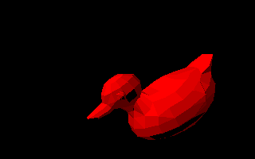
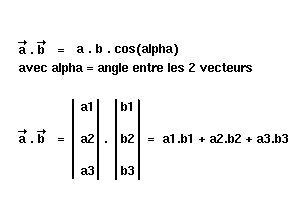
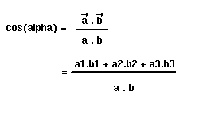
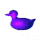
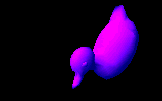

# Les modèles d’illumination

Maintenant que nous pouvons remplir les faces de nos objets, il serait
intéressant de leur donner un aspect un peu plus réaliste. La manière la
plus simple est d’introduire une source lumineuse dans la scène. Il
existe plusieurs méthodes, certaines étant très efficaces. Je vais vous
présenter ici des manières simplifiées d’implémenter ces techniques
**en local** (en global, il faudrait prendre en compte la contribution
de chaque point). Pour en savoir plus, n’hésitez pas à lire « Computer
Graphics, principles and practice » de chez Addison-Wesley. Je crois
qu’il existe une édition française pour étudiants, mais qui est moins
complète (le titre ? « Initiation à l’infographie », mais avec
réserves…)

Dans le cadre général, il faudrait pour bien faire utiliser la formule
suivante :

**L(P,V) = somme ( S(P,V,Vi) L(P,-Vi) )**

## Le modèle de Lambert (Flat)


Il s’agit sans aucun doute du modèle d’illumination le plus simple qui
soit. Le principe consiste à placer dans la scène une source lumineuse
située à l’infini, et éclairant ainsi uniformément chaque point d’une
facette ([flat.zip](src/flat.zip)). Ainsi, chacune des faces composant
l’objet sera dessinée avec une couleur unique. Ce modèle est donc très
simple à mettre en oeuvre et extrêmement rapide.



*Toujours le canard, en modèle flat*

Avant d’aller plus loin, vous devez savoir ce qu’est un produit
scalaire de 2 vecteurs. Pour les nuls en math (pleurez pas c’est pas si
grave) je vais faire un petit rappel. Le produit scalaire est une
opération qui multiplie 2 vecteurs entre eux, et qui donne pour résultat
un scalaire (un nombre). On peut écrire cette opération sous 2 formes :



Ce calcul est appliqué lorsqu’on veut déterminer l’angle entre 2
vecteurs. Pour cela, il suffit de combiner les 2 égalités pour obtenir
finalement :



Ainsi, pour déterminer la couleur d’une facette, il faut calculer la
quantité de lumière qui arrive sur cette face. Elle est proportionnelle
à l’angle entre la normale et la source lumineuse. Plus le cosinus sera
petit, plus la facette sera perpendiculaire à la lumière, et donc plus
elle sera éclairée.

La source lumineuse va être fixe dans la scène, mais il serait possible
de la faire bouger. On pourrait par exemple la faire tourner autour de
l’objet à éclairer, ce qui donne un effet assez joli. Elle est
représentée en mémoire par un vecteur, que nous appellerons le vecteur
lumière. Par exemple, si nous voulons que la lumière arrive d’en haut à
gauche et du coté de l’observateur, nous devrions définir ce vecteur
ainsi :

```C
lumiere.x = 10;
lumiere.y = 10;
lumiere.z = 10;
```

En pratique, ce n’est pas tout à fait le cas. En fait, nous allons
juste changer le signe de chacune des coordonnées du vecteur. Ainsi,
nous pourrons effectuer le produit scalaire entre ce vecteur et la
normale de la surface à éclairer en toute tranquillité. Mais on peut
très bien ne pas faire ça, il faudra juste inverser l’angle obtenu par
produit scalaire.

Étant donné que l’on a besoin de la normale de chaque facette, il va
être très coûteux de la recalculer à chaque nouvelle image. Il est
possible de les précalculer une fois pour toute, et ensuite on n’aura
qu’a leur faire subir la même rotation que les sommets. La structure
des facettes sera modifiée dans cette optique :

```C
    typedef struct
    {
      int a,b,c;
      unsigned char couleur;
      double z;

      /* On stocke les normales */
      float nx,ny,nz;              /* Vecteur normal de la face     */
      float nx2,ny2,nz2;           /* Vecteur normal après rotation  */
      float norme;                 /* norme (invariable)            */
    } face;
```

Pour obtenir la normale à une facette, nous avons déjà vu qu’il
suffisait d’effectuer un produit vectoriel avec 2 vecteurs appartenant
à cette facette. Ces vecteurs, appelés a et b dans la fonction suivante,
sont facilement calculables : j’espère que vous comprenez comment faire
!

```C
    void CalculerNormales()
    {
      int i;
      float a[3],b[3];

      for(i=0;i<Nb_faces;i++)
      {
        a[0] = (Sommet[Facette[i].a].x-Sommet[Facette[i].b].x);
        a[1] = (Sommet[Facette[i].a].y-Sommet[Facette[i].b].y);
        a[2] = (Sommet[Facette[i].a].z-Sommet[Facette[i].b].z);

        b[0] = (Sommet[Facette[i].a].x-Sommet[Facette[i].c].x);
        b[1] = (Sommet[Facette[i].a].y-Sommet[Facette[i].c].y);
        b[2] = (Sommet[Facette[i].a].z-Sommet[Facette[i].c].z);


        /* produit vectoriel => normale à la face */

        Facette[i].nx = a[1]*b[2]-a[2]*b[1];
        Facette[i].ny = a[2]*b[0]-a[0]*b[2];
        Facette[i].nz = a[0]*b[1]-a[1]*b[0];

        Facette[i].norme = sqrt(  Facette[i].nx*Facette[i].nx
                                + Facette[i].ny*Facette[i].ny
                                + Facette[i].nz*Facette[i].nz );
      }
    }
```

Il est important de noter que les rotations conservent les distances. Il
est inutile de recalculer la norme du vecteur normal à chaque fois, ca
sera toujours la même chose.

Ensuite, il suffit de leur appliquer la même rotation qu’aux sommets de
l’objet. Voici ce que devient alors notre fonction de rotation :

```C
    void Rotation(int Xa, int Ya, int Za)
    {
      int i;

      /* Calcul de la matrice de rotation 3*3 */

      matrice[0][0] = Cos[Za]*Cos[Ya];
      matrice[1][0] = Sin[Za]*Cos[Ya];
      matrice[2][0] = -Sin[Ya];

      matrice[0][1] = Cos[Za]*Sin[Ya]*Sin[Xa] - Sin[Za]*Cos[Xa];
      matrice[1][1] = Sin[Za]*Sin[Ya]*Sin[Xa] + Cos[Xa]*Cos[Za];
      matrice[2][1] = Sin[Xa]*Cos[Ya];

      matrice[0][2] = Cos[Za]*Sin[Ya]*Cos[Xa] + Sin[Za]*Sin[Xa];
      matrice[1][2] = Sin[Za]*Sin[Ya]*Cos[Xa] - Cos[Za]*Sin[Xa];
      matrice[2][2] = Cos[Xa]*Cos[Ya];


      /* Rotation des sommets de l'objet */

      for(i=0;i<Nb_points;i++)
      {
        Point3D[i].x =   matrice[0][0]*Sommet[i].x
                       + matrice[1][0]*Sommet[i].y
                       + matrice[2][0]*Sommet[i].z;

        Point3D[i].y =   matrice[0][1]*Sommet[i].x
                       + matrice[1][1]*Sommet[i].y
                       + matrice[2][1]*Sommet[i].z;

        Point3D[i].z =   matrice[0][2]*Sommet[i].x
                       + matrice[1][2]*Sommet[i].y
                       + matrice[2][2]*Sommet[i].z;
      }

      for(i=0;i<Nb_faces;i++)
      {
        Facette[i].nx2=  matrice[0][0]*Facette[i].nx
                       + matrice[1][0]*Facette[i].ny
                       + matrice[2][0]*Facette[i].nz;

        Facette[i].ny2=  matrice[0][1]*Facette[i].nx
                       + matrice[1][1]*Facette[i].ny
                       + matrice[2][1]*Facette[i].nz;

        Facette[i].nz2=  matrice[0][2]*Facette[i].nx
                       + matrice[1][2]*Facette[i].ny
                       + matrice[2][2]*Facette[i].nz;
      }
    }
```

Maintenant il ne reste plus qu’à remplir la facette avec la bonne
couleur. On peut le faire par exemple avec

```C
      FillPoly(p,3,Facette[i].couleur+CalculIntensite(i));
```

La fonction `CalculIntensite()` va simplement effectuer un produit
scalaire entre la normale de la face et le vecteur lumière, et retourner
une valeur entière. Avec une palette correctement préparée, par exemple
un dégradé, le résultat est assez beau et relativement satisfaisant.

```C
    int CalculIntensite(int i)
    {
      int res;

      /* juste un petit produit scalaire => donne le cosinus (entre -1 et 1) */
      res= (Facette[i].nx2*lumiere[0]
           +Facette[i].ny2*lumiere[1]
           +Facette[i].nz2*lumiere[2])*31
          /(normelumiere*Facette[i].norme);

      if (res>0) return 32-res;
      else return 31;
    }
```

Vous retrouverez les sources d’un exemple dans [flat.zip](src/flat.zip). Il
s’utilise comme les programmes précédents, mais vous pouvez vous amuser
à changer la taille de l’objet en utilisant les touches + et -.
Attention cependant, il n’y a pas de clipping sur Z.

## Un modèle simplifié de Gouraud



Ce modèle, complètement empirique, s’appuie sur une interpolation de la
couleur. Le principe est le suivant :

-   calcul des normales aux sommets des facettes
-   calcul des couleurs aux sommets des facettes
-   interpolation des couleurs



*Lissage des facettes en Gouraud ([gouraud.zip](src/gouraud.zip))*

La première étape peut vous choquer : votre esprit pertinent vous à
certainement déjà dit : « la normale d’un sommet ? Ça va pas non, ça
existe pas ! ». Il ne s’agit pas d’une véritable normale, mais
seulement d’une approximation. Pour calculer un tel vecteur, pas de
panique, la méthode utilisée est la plus simple que l’on puisse trouver
et ne demande aucune justification mathématique. Pour obtenir la normale
d’un sommet, on va simplement faire la moyenne de toutes les normales
des facettes qui contiennent ce sommet. Simple non ?

```C
    void CalculerNormales()
    {
      double a[3],b[3];
      double nx,ny,nz;
      int    nb;
      int    i,j;

      /* Calcul de la normale de chaque facette */

       /* ......  */

      /* Calcul de la pseudo-normale pour chaque sommet  */
      /* qui sera utilisée pour le Gouraud (et le Phong) */
      /* Consiste a faire la moyenne des normales des    */
      /* facettes qui contiennent le sommet traité       */

      for(i=0;i<Nb_points;i++)
      {
        nx=ny=nz=0;
        nb=0;

        for(j=0;j<Nb_faces;j++)
        {
          if (Facette[j].a==i || Facette[j].b==i || Facette[j].c==i)
          {
            nx+=Facette[j].nx;
            ny+=Facette[j].ny;
            nz+=Facette[j].nz;

            nb++;
          }
        }

        Sommet[i].nx=nx/nb;
        Sommet[i].ny=ny/nb;
        Sommet[i].nz=nz/nb;
        Sommet[i].norme = sqrt(  Sommet[i].nx*Sommet[i].nx
                               + Sommet[i].ny*Sommet[i].ny
                               + Sommet[i].nz*Sommet[i].nz );
      }
    }
```

Nous pouvons maintenant passer à la deuxième étape, le calcul de
l’intensité aux sommets. Là encore, pas de secret. Nous allons
reprendre la formule utilisée pour le « modèle » de Lambert, mais au
lieu d’utiliser la normale de la face, on va bien sur se servir de
cette pseudo-normale que l’on vient de calculer.

Reste à présent à interpoler nos couleurs. Nous savons déjà comment
interpoler les points entre les sommets pour ensuite remplir notre
polygone. Faisons de même pour les couleurs. Pour chaque ligne
horizontale, il nous suffit de calculer le pas incrémental à ajouter à
notre couleur. Le code est pratiquement identique à la fonction de
remplissage classique.

```C
    void HlineGouraud(int x1, int coul1, int x2, int coul2, int y)
    {
      long difx,pas;
      long nbcoul,couleur;
      long x;
      long indice;

      /* initialisations diverses ... */

     
      nbcoul  = coul2-coul1+1;
      couleur = coul1<<8;
      pas     = (nbcoul<<8)/difx;

      indice=y*320+x1;

      for(x=x1;x<=x2;x++)
      {
        if(x>=0 && x<Xmax)
          screen[indice]=(couleur>>8);
        indice++;
        couleur+=pas;
      }
    }
```

Mais pour pouvoir faire ça, nous devons connaître les couleurs au début
et la fin de chaque ligne horizontale. Il faut commencer par stocker
pour chaque sommet sa couleur. La définition d’un point va se trouver
modifiée :

```C
    typedef struct
    {
      int x,y;
      int couleur;
    } point;
```

Pour remplir un polygone, nous utilisons deux tableaux, `startx[]`
et `endx[]`. Pour nos couleurs, nous allons utiliser également deux
tableaux, `startcol[]` et `endcol[]` qui seront initialisés en
même temps. En fait, il faut interpoler les couleurs entre les lignes de
la même manière qu’on interpole les coordonnées x. Pour accélérer les
calculs, nous travaillerons encore une fois en virgule fixe.

```C
    void InitSegmentGouraud(point p1, point p2)
    {
      int temp,y;
      long x,pas;
      long coul,pacoul;

      /* initialisations .... */

      x      = (long)p1.x<<8;
      pas    = ((long)(p2.x-p1.x)<<8)/(long)(p2.y-p1.y);

      coul   = p1.couleur<<8;
      pacoul = ((long)(p2.couleur-p1.couleur)<<8)/(long)(p2.y-p1.y);

      x+=pas;
      p1.y++;
      coul+=pacoul;

      if(p1.y<miny) miny=p1.y;
      if(p2.y>maxy) maxy=p2.y;

      for(y=p1.y;y<=p2.y;y++)
        {
          if((y>=0) && (y<200))
            if(startx[y]==-16000)
            {
              startx[y]   = x >> 8;
              startcol[y] = coul >> 8;
            }
            else
            {
              endx[y]   = x >> 8;
              endcol[y] = coul >> 8;
            }

          x    += pas;
          coul += pacoul;
        }
      }
    }
```

Ce n’est pas plus compliqué que ça ! L’avantage de cette technique est
qu’elle est vraiment très rapide, et elle produit des images qui sont
assez jolies ([gouraud.zip](src/gouraud.zip)). Seulement ce n’est pas une
méthode d’éclairage réaliste, et elle n’est pas stable (selon le sens
de parcours employé lors du remplissage, la couleur d’un point peut
varier). Elle permet néanmoins de lisser les facettes des objets, même
si certaines bandes peuvent apparaître sur les arêtes.

## Le modèle de Phong

Ce modèle a été très largement exploré par les programmeurs du monde
entier, car il permet d’obtenir des images de très bonne qualité. Il
permet en outre de reproduire aussi bien des objets au comportement
diffus que des objets spéculaires. En résumé, au lieu d’interpoler les
couleurs comme Gouraud le fait, nous allons interpoler les normales. En
utilisant une bonne fonction de calcul d’intensité lumineuse (un peu
plus évoluée que celle que j’ai présentée dans ce cours) le résultat
est vraiment très satisfaisant et réaliste.

*\[Suite en cours de réalisation\... Merci de bien vouloir m’excuser\]*

